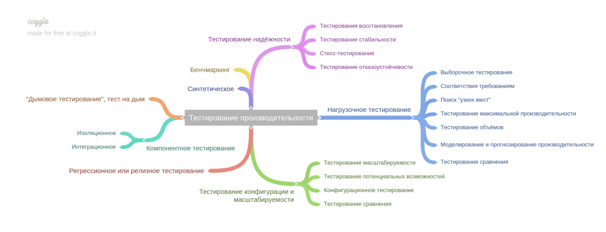

## Грейд 10

### Theory  

#### Паттерны проектирования: поведенческие  
Эти паттерны решают задачи эффективного и безопасного взаимодействия между объектами программы.  

Цепочка обязанностей — это поведенческий паттерн проектирования, который позволяет передавать запросы последовательно  
по цепочке обработчиков. Каждый последующий обработчик решает, может ли он обработать запрос сам и стоит  
ли передавать запрос дальше по цепи.  

Команда — это поведенческий паттерн проектирования, который превращает запросы в объекты, позволяя передавать их как  
аргументы при вызове методов, ставить запросы в очередь, логировать их, а также поддерживать отмену операций.  

Итератор — это поведенческий паттерн проектирования, который даёт возможность последовательно обходить элементы составных 
объектов, не раскрывая их внутреннего представления.  

Посредник — это поведенческий паттерн проектирования, который позволяет уменьшить связанность множества классов  
между собой, благодаря перемещению этих связей в один класс-посредник.  

Снимок — это поведенческий паттерн проектирования, который позволяет сохранять и восстанавливать прошлые  
состояния объектов, не раскрывая подробностей их реализации.

Наблюдатель — это поведенческий паттерн проектирования, который создаёт механизм подписки, позволяющий одним  
объектам следить и реагировать на события, происходящие в других объектах.  

Состояние — это поведенческий паттерн проектирования, который позволяет объектам менять поведение в зависимости от  
своего состояния. Извне создаётся впечатление, что изменился класс объекта.  

Стратегия — это поведенческий паттерн проектирования, который определяет семейство схожих алгоритмов и помещает  
каждый из них в собственный класс, после чего алгоритмы можно взаимозаменять прямо во время исполнения программы.  

Шаблонный метод — это поведенческий паттерн проектирования, который определяет скелет алгоритма, перекладывая  
ответственность за некоторые его шаги на подклассы. Паттерн позволяет подклассам переопределять шаги  
алгоритма, не меняя его общей структуры.  

Посетитель — это поведенческий паттерн проектирования, который позволяет добавлять в программу новые операции, не  
изменяя классы объектов, над которыми эти операции могут выполняться.  

#### Проектирование REST API  
Что такое REST
Representational State Transfer (REST) — передача представлений состояний. Стиль построения архитектуры распределенного  
приложения. Был описан и популяризован в 2000 году Роем Филдингом (Roy Fielding), одним из создателей протокола HTTP.  

Суть реализации RESTful API — это представление логики работы в виде набора объектов(сущностей) с  
изменяемым состоянием. Средство реализации — протокол HTTP 1.1, его методы, статусы, заголовки. 

Для изменения состояния объекта используется 4 метода:
GET     | Read                          — Получение информации об объекте  
POST    | Create                        — Создание нового объекта  
PUT     | Update/Replace                — Обновление/замена информации об объекте  
PATCH   | Update/Modify                 — Обновление/редактирование информации об объекте  
DELETE  | Delete                        — Удаление объекта  

#### Способы доступа к данным: CRUD ORM AR Doctrine  
CRUD — акроним, обозначающий четыре базовые функции, используемые при работе с базами данных:  
создание (create),  
чтение (read),  
модификация (update),  
удаление (delete).

ORM - (Object-Relational Mapping, рус. объектно-реляционное отображение, или преобразование) — технология  
программирования, которая связывает базы данных с концепциями объектно-ориентированных языков программирования,  
создавая «виртуальную объектную базу данных». Существуют как проприетарные, так и свободные реализации этой технологии.  

Active record (AR) — шаблон проектирования приложений. AR является популярным способом доступа к данным реляционных  
баз данных в объектно-ориентированном программировании.
Схема Active Record — это подход к доступу к данным в базе данных. Таблица базы данных или представление обёрнуты в  
классы. Таким образом, объектный экземпляр привязан к единственной строке в таблице. После создания объекта  
новая строка будет добавляться к таблице на сохранение. Любой загруженный объект получает свою информацию от базы данных.  
Когда объект обновлён, соответствующая строка в таблице также будет обновлена. Класс обёртки реализует методы средства  
доступа или свойства для каждого столбца в таблице или представлении.  

Doctrine — объектно-реляционный проектор (Object-Relational Mapping) для PHP 7.1+, который базируется на слое абстракции доступа к БД (DBAL).  
Одной из ключевых возможностей Doctrine является запись запросов к БД на собственном объектно-ориентированном диалекте  
SQL, называемом DQL (Doctrine Query Language) и базирующемся на идеях HQL (Hibernate Query Language).  

### Language  

#### ООП в PHP Позднее статическое связывание
ключевое слово static для указания на класс в последнем не переоопределенном вызове.
"Позднее связывание" отражает тот факт, что обращения через static:: не будут вычисляться по отношению к классу, в  
котором вызываемый метод определён, а будут вычисляться на основе информации в ходе исполнения.  

```php
class A {
    public static function who() {
        echo __CLASS__;
    }
    public static function test() {
        self::who();
    }
}

class B extends A {
    public static function who() {
        echo __CLASS__;
    }
}

/** Пример с поздним статическим связыванием */
B::test();
// A

class A {
    public static function who() {
        echo __CLASS__;
    }
    public static function test() {
        static::who(); // Здесь действует позднее статическое связывание
    }
}

class B extends A {
    public static function who() {
        echo __CLASS__;
    }
}

B::test();
// B
```

#### PHP Паттерны проектирования: "фабрика"  
#### PHP Паттерны проектирования: "адаптер"  

### Framework  

#### Yii2 Фильтры - AccessControl  
Фильтры являются особым видом поведений. Их использование ничем не отличается от использования поведений. Вы можете  
объявлять фильтры в классе контроллера путём перекрытия метода behaviors()  
Фильтр AccessControl обеспечивает простое управление доступом, основанное на наборе правил rules.  

```php
use yii\filters\AccessControl;

public function behaviors()
{
    return [
        'access' => [
            'class' => AccessControl::className(),
            'denyCallback' => function ($rule, $action) {
                //можем определить свой сценарий для обработки ошибки доступа
                 throw new \Exception('У вас нет доступа к этой странице');
             },
            'only' => ['create', 'update'],
            'rules' => [
                // разрешаем аутентифицированным пользователям
                [
                    'allow' => true,
                    'roles' => ['@'],
                ],
                [
                     'allow' => true, // разрешаем действие
                     'actions' => ['login', 'signup'], // определяем конкретные endpoint
                     'roles' => ['?'], // указываем, кто может получить разрешение
                ],
            ],
        ],
    ];
}
```

#### Yii2 Формы  
Основным способом использования форм в Yii является использование yii\widgets\ActiveForm.  
Во время инициализации формы так же задается _csrf токен.
$form->field поддерживает все основные html теги.

Так же можно использовать кастомизированые инпуты с виджетами.
```php
<?php
use yii\helpers\Html;
use yii\widgets\ActiveForm;

$form = ActiveForm::begin([
    'id' => 'login-form',
    'options' => ['class' => 'form-horizontal'],
]) ?>
    <?= $form->field($model, 'username') ?>
    <?= $form->field($model, 'password')->passwordInput() ?>

    <div class="form-group">
        <div class="col-lg-offset-1 col-lg-11">
            <?= Html::submitButton('Вход', ['class' => 'btn btn-primary']) ?>
        </div>
    </div>
<?php ActiveForm::end() ?>
```

#### Yii2 Логирование  
Использование Системы логирования Yii включает следующие шаги:  
- Запись сообщений лога в различных частях кода приложения;
- Настройка целей лога в конфигурации приложения;
- Изучение отфильтрованных сообщений лога, например, при помощи Отладчика Yii.

```php
//web or console configure file.
'components' => [
        'log' => [
            'targets' => [
                  'ex400' => [
                    'class' => 'yii\log\FileTarget',
                    'levels' => ['error'],
                    'logFile' => __DIR__ . '/../logs/400Log',
                    'logVars' => [],
                    'categories' => [
                        'yii\web\HttpException:400',
                    ],
                ],
            ],
        ],
    ],
```
error: Yii::error(): записывает критическую ошибку, на которую нужно, как можно скорее, обратить внимание.  
warning: Yii::warning(): записывает тревожное сообщение при возникновении неожиданного события.  
info: Yii::info(): записывает сообщение, содержащее какую-либо полезную информацию.  
trace: Yii::debug(): записывает сообщения для отслеживания выполнения кода приложения. Используется, в основном, при разработке.  
profile: соответствует сообщениям, сохраненным методами Yii::beginProfile() и Yii::endProfile(), подробнее о которых написано в подразделе Профилирование производительности.  

Временная метка [IP-адрес][ID пользователя][ID сессии][Уровень важности][Категория] Текст сообщения  

### Testing
#### Нагрузочное тестирование  
Считается, что тестирование производительности — это то тестирование, которое не является функциональным. Существует  
множество видов тестирования производительности. Классификация видов тестирования производительности строится на  
основе того, какие цели преследует определенный вид тестирования. Как правило тестирование производительности преследует  
не одну, а несколько целей в связи с тем, многие типы тестирования в ходе его проведения совмещаются с другими целями  
или повторяются несколько раз в ходе цикла тестирования. Основное отличие тестирования производительности также  
заключается в том, что оно происходит только после полного функционального тестирования. Ошибки функциональности не  
исправляются в ходе тестирования производительности. Для данного вида тестирования чаще всего выделяется отдельный  
нагрузочный стенд, повторяющий копию промышленного стенда. В связи с массовым распространением Agile методологий  
тестирование производительности также интегрируется в жизненный цикл разработки программного обеспечения.  



### Storage  

#### Схемы БД
База данных содержит одну или несколько именованных схем, которые в свою очередь содержат таблицы. Схемы также  
содержат именованные объекты других видов, включая типы данных, функции и операторы. Одно и то же имя объекта  
можно свободно использовать в разных схемах, например и schema1, и myschema могут содержать таблицы с именем mytable.  
В отличие от баз данных, схемы не ограничивают доступ к данным: пользователь может обращаться к объектам в любой схеме  
текущей базы данных, если ему назначены соответствующие права.  

Есть несколько возможных объяснений, для чего стоит применять схемы:
- Чтобы одну базу данных могли использовать несколько пользователей, независимо друг от друга.
- Чтобы объединить объекты базы данных в логические группы для облегчения управления ими.
- Чтобы в одной базе сосуществовали разные приложения, и при этом не возникало конфликтов имён.

#### Доступ к БД  
Основные модели баз данных:
- Иерархическая — представление базы данных в виде древовидной (иерархической) структуры, состоящей из объектов (данных)  различных уровней,  структура запись-потомок должна иметь в точности одного предка.
- Сетевая - являющаяся расширением иерархического подхода, сетевой структуре данных у потомка может иметься любое число предков.
- Реляционная - данные в базе данных представляют собой набор отношений. Отношения (таблицы) отвечают определенным условиям целостности. Реляционная модель данных поддерживает декларативные ограничения целостности уровня домена (типа данных), уровня отношения и уровня базы данных.
- Объектная и объектно-ориентированная – Данные в таких базах представляют из себя объекты с определенными наборами свойств и методов и поведения. Отношения данных объектов строятся на основе  обобщения свойств и методов и поведения различных объектов по отношению друг к другу.


### DB
#### PostgreSQL Пользователи
createuser — создать новую учётную запись PostgreSQL  
createuser — это обёртка для SQL-команды CREATE ROLE. Создание пользователей с её помощью по сути не отличается от  
выполнения того же действия при обращении к серверу другими способами.  
```sql
createuser [параметр-подключения...] [параметр...] [имя_пользователя]
```
Чтобы создать роль joe с правами суперпользователя и предустановленным паролем:  
```sql
createuser -P -s -e joe
```

#### PostgreSQL разрешения 
PostgreSQL использует концепцию ролей (roles) для управления разрешениями на доступ к базе данных. Роль можно  
рассматривать как пользователя базы данных или как группу пользователей, в зависимости от того как роль настроена.  
Роли могут владеть объектами базы данных (например, таблицами) и выдавать другим ролям разрешения на доступ к этим  
объектам, управляя тем, кто имеет доступ и к каким объектам. Кроме того, можно предоставить одной роли членство в  
другой роли, таким образом одна роль может использовать привилегии других ролей.  
```sql
CREATE ROLE name;
```
Рекомендуется создать роль с привилегиями CREATEDB и CREATEROLE, но не суперпользователя и в последующем использовать  
её для управления базами данных и ролями. Такой подход позволит избежать опасностей, связанных с использованием  
полномочий суперпользователя для задач, которые их не требуют.  

#### PostgreSQL схемы
```sql
CREATE SCHEMA myschema;

CREATE TABLE myschema.mytable (
    ...
);
```

#### PostgreSQL Объединение  
Оператор UNION позволяет объединить два множества (условно две таблицы). Но в отличие от inner/outer join объединения  
соединяют не столбцы разных таблиц, а два однотипных набора в один.  
```sql
SELECT FirstName, LastName
FROM Customers
UNION SELECT FirstName, LastName FROM Employees;
```

### Frontend  

#### JS Prototype  
```javascript
let animal = {
    eats: true
};

function Rabbit(name) {
    this.name = name;
}

Rabbit.prototype = animal;

let rabbit = new Rabbit("White Rabbit"); //  rabbit.__proto__ == animal

alert( rabbit.eats ); // true
```
F.prototype используется только в момент вызова new F()  
F.prototype используется только при вызове new F() и присваивается в качестве свойства [[Prototype]] нового объекта.  
После этого F.prototype и новый объект ничего не связывает. Следует понимать это как «единоразовый подарок» объекту.  
После создания F.prototype может измениться, и новые объекты, созданные с помощью new F(), будут иметь другой объект в  
качестве [[Prototype]], но уже существующие объекты сохранят старый.  


### DevOps  
#### Оптимизация PHP  

#### Логи  
Логи (лог-файлы) — это файлы, содержащие системную информацию работы сервера или компьютера, в которые заносятся  
определенные действия пользователя или программы. Иногда также употребляется русскоязычный аналог понятия — журнал.  
Их предназначение — протоколирование операций, выполняемых на машине, для дальнейшего анализа администратором.   
Регулярный просмотр журналов позволит определить ошибки в работе системы в целом, конкретного сервиса или сайта  
(особенно скрытые ошибки, которые не выводятся при просмотре в браузере), диагностировать злонамеренную активность,  
собрать статистику посещений сайта.  

### Misc  
#### Code-review  
#### Memcached  
Memcached (читается мемкЭшид) — это система кэширования различных объектов в оперативной памяти. Позволят значительно  
снизить нагрузку на базу или файловую систему и ускорить работу сайта, за счет того, что работа с памятью быстрее чем  
с базой или файлами. Насколько я помню была разработана для LJ, а сейчас применяется практически на всех проектах с  
большим количеством пользователей. Запускается отдельным сервером.  

#### Redis  
Redis – это высокопроизводительная БД с открытым исходным кодом (лицензия BSD), которая хранит данные в памяти,  
доступ к которым осуществляется по ключу доступа. Так же Редис это кэш и брокер сообщений.  