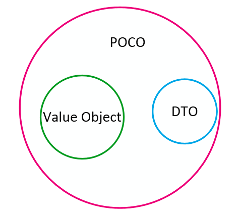

## Грейд 14

### Theory

#### Принципы разработки: GRASP

GRASP — General Responsibility Assignment Software Patterns  
(основные шаблоны распределения обязанностей в программном обеспечении)  

GRASP состоит из 9 шаблонов:
- Creator
- Information Expert
- Controller
- Low Coupling
- High Cohesion
- Pure Fabrication
- Indirection
- Polymorphism
- Protected Variations

##### Creator
Шаблон creator говорит нам какие условия должны соблюстись, что бы объекты верно порождали друг друга. 
Для этого есть несколько правил.  

Объект А должен порождать объект Б, если:
- объект А содержит или агрегирует объекты Б (содержит в себе как свойство или коллекцию)
- объект А активно использует объекты Б (основной объем работы с объектом Б происходит посредством объекта А)
- объект А обладает данными инициализации объекта Б (каждый раз при создании объекта Б, данные берутся из объекта А)


##### Information Expert
Информационный эксперт занимается предоставлением информации об объекте.  

Information Expert должен отвечать на такие вопросы:
- Кто должен знать кол-во комментариев к посту? (Post)
- Кто должен знать общее кол-во комментариев в блоге? (Blog -> Post)


##### Controller (endpoint, ручка)
Обязанности по обработке входящих системных сообщений необходимо делегировать специальному объекту Controller'у.  
Controller — это объект, который отвечает за обработку системных событий, и при этом не относится к  
интерфейсу пользователя. Controller определяет методы для выполнения системных операций.  
Это не что иное, как C из аббревиатуры MVC

##### Low Coupling
Это принцип распределения обязанностей, который помогает делать части системы зависимыми от от наименьшего количества  
других частей. Тоесть организовать слабое зацепление модулей.  

Низкая связанность, отвечает за то, что бы объекты в системе знали друг о друге как можно меньше. Ведь чем меньше  
объект знает о других объектах, тем больше будет изолировано и тем меньше правок необходимо будет делать, если  
в системе что-то поменяется. 

Хорошим примером Low Coupling может случить реализация Dependency inversion  
Мы не выстраиваем жестких связей внутри классов, а передаем их через конструктор, аргументы методов, сеттеры.  

##### High Cohesion
High Cohesion твердит, что класс должен стараться выполнять как можно меньше не специфичных для него задач,  
и иметь вполне определенную область применения.  
В этом подходе идет отсылка на Single responsibility.  

##### Pure Fabrication
Паттерн синтезирует в себе Low Coupling и High Cohesion, в пример приводится условный класс Shape и задание на сохранение  
его в базу данных. Для этого следует выделить отдельный класс DbStore (или лучше ShapeRepository) перенеся отвественность  
за работу с БД с класса Shape на ShapeRepository.

##### Indirection
Этот шаблон решает проблему прямой связности. Решается введением промежуточного объекта для обеспечения связи  
между частями программы, которые не связаны между собой напрямую.  
Так же вариантами посредника являются шаблоны Adapter, Facade, Observer.  
Паттерн подразумевает следующее: любой объект в коде необходимо вызывать через его интерфейс  
(тот самый промежуточный объект).  

##### Polymorphism
Полиморфизм позволяет обрабатывать альтернативные варианты поведения на основе типа и заменять подключаемые  
компоненты системы.  
Другой, более продвинутый пример полиморфизма: с абстрактным классом. Абстрактный класс, это класс, который  
содержит хотя бы один абстрактный метод.  

##### Protected Variations
Необходимо спроектировать систему так, чтобы изменение одних ее элементов не влияло на другие. В качестве  
решения предлагается идентифицировать точки возмоджных изменений или неустойчивости и распределить обязанности  
таким образом, чтобы обеспечить устойчивую работу системы.
На самом деле, это не паттерн, а цель, достигаемая соблюдением остальных паттернов.  

#### Domain Driven Design

#### DDD Inversion of Control


### Language

#### Value Object DTO POCO

##### Data Transfer Object
DTO — это класс, содержащий данные без какой-либо логики для работы с ними. DTO обычно используются для передачи  
данных между различными приложениями, либо между слоями внутри одного приложения. Их можно рассматривать как  
хранилище информации, единственная цель которого — передать эту информацию получателю.  

##### Value Object
Value Object — это полноценный член вашей доменной модели. Он подчиняется тем же правилам, что и сущности (Entities).  
Единственное отличие между Value Object и Entity в том, что у Value Object-а нет собственной идентичности.  
Это означает, что два Value Object-а с одинаковыми свойствами могут считаться идентичными, в то время как две  
сущности отличаются друг от друга даже в случае если их свойства полностью совпадают.  
Value Object-ы могут содержать логику и обычно они не используются для передачи информации между приложениями.  

##### Plain Old CLR Object
Понятие POCO означает использование настолько простых классов насколько возможно для моделирования предметной области.  
Это понятие помогает придерживаться принципов YAGNI, KISS и остальных best practices.  
POCO классы могут содержать логику.  



#### DDD: DI  
Inversion of Control (инверсия управления) — это некий абстрактный принцип, набор рекомендаций для написания  
слабо связанного кода. Суть которого в том, что каждый компонент системы должен быть как можно более  
изолированным от других, не полагаясь в своей работе на детали конкретной реализации других компонентов.  
Dependency Injection (внедрение зависимостей) — это одна из реализаций этого принципа  
(помимо этого есть еще Factory Method, Service Locator).
IoC-контейнер — это какая-то библиотека, фреймворк, программа если хотите, которая позволит вам  
упростить и автоматизировать написание кода с использованием данного подхода на столько, на сколько это возможно.  


### Framework

### Yii2 Реализация DI

Yii обеспечивает функционал контейнера внедрения зависимостей через класс yii\di\Container. Он поддерживает следующие виды внедрения зависимостей:
- Внедрение зависимости через конструктор;
- Внедрение зависимости через метод;
- Внедрение зависимости через сеттер и свойство;
- Внедрение зависимости через PHP callback;

Поскольку Service Locator часто используется с конфигурациями, в нём имеется доступное для записи свойство components.  
Это позволяет настроить и зарегистрировать сразу несколько компонентов. Следующий код демонстрирует  
конфигурационный массив, который может использоваться для регистрации компонентов в Service Locator  

```php
    'components' => [
        'tester' => [
            'class' => \app\components\TestComponent::class,
        ],
    ],
```

При загрузке приложения (new yii\web\Application($config))->run(); произойдет инициалиция компонентов (зависимостей).  

Способы обращения  

```php
Yii::$app->tester->test(); // Должен быть указан в config['components']

$tester = Yii::$container->get(TestComponent::class);
$tester->test();

$tester = Yii::$app->get('tester'); // Должен быть указан в config['components']
$tester->test();
```