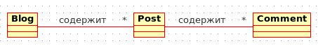
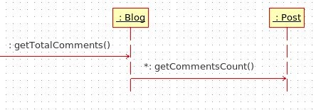

## Грейд 14

### Theory

#### Принципы разработки: GRASP  

GRASP — General Responsibility Assignment Software Patterns  
(основные шаблоны распределения обязанностей в программном обеспечении)  

GRASP состоит из 9 шаблонов:
- Creator
- Information Expert
- Controller
- Pure Fabrication
- High Cohesion
- Indirection
- Low Coupling
- Polymorphism
- Protected Variations

#### Creator
Шаблон creator говорит нам какие условия должны соблюстись, что бы объекты верно порождали друг друга. 
Для этого есть несколько правил.  

Объект А должен порождать объект Б, если:
- объект А содержит или агрегирует объекты Б (содержит в себе как свойство или коллекцию)
- объект А активно использует объекты Б (основной объем работы с объектом Б происходит посредством объекта А)
- объект А обладает данными инициализации объекта Б (каждый раз при создании объекта Б, данные берутся из объекта А)

#### Information Expert
Информационный эксперт занимается предоставлением информации об объекте.  

Information Expert должен отвечать на такие вопросы:
- Кто должен знать кол-во комментариев к посту? (Post)
- Кто должен знать общее кол-во комментариев в блоге? (Blog -> Post)

#### Controller (endpoint, ручка)
Обязанности по обработке входящих системных сообщений необходимо делегировать специальному объекту Controller'у.  
Controller — это объект, который отвечает за обработку системных событий, и при этом не относится к  
интерфейсу пользователя. Controller определяет методы для выполнения системных операций.  
Это не что иное, как C из аббревиатуры MVC