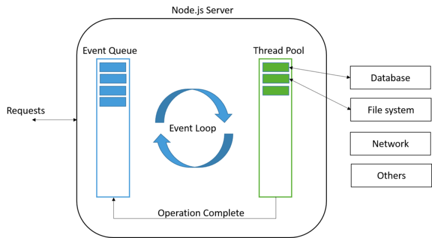

## Грейд 14

### Theory

#### Принципы разработки: GRASP

GRASP — General Responsibility Assignment Software Patterns  
(основные шаблоны распределения обязанностей в программном обеспечении)  

GRASP состоит из 9 шаблонов:
- Creator
- Information Expert
- Controller
- Low Coupling
- High Cohesion
- Pure Fabrication
- Indirection
- Polymorphism
- Protected Variations

##### Creator
Шаблон creator говорит нам какие условия должны соблюстись, что бы объекты верно порождали друг друга. 
Для этого есть несколько правил.  

Объект А должен порождать объект Б, если:
- объект А содержит или агрегирует объекты Б (содержит в себе как свойство или коллекцию)
- объект А активно использует объекты Б (основной объем работы с объектом Б происходит посредством объекта А)
- объект А обладает данными инициализации объекта Б (каждый раз при создании объекта Б, данные берутся из объекта А)


##### Information Expert
Информационный эксперт занимается предоставлением информации об объекте.  

Information Expert должен отвечать на такие вопросы:
- Кто должен знать кол-во комментариев к посту? (Post)
- Кто должен знать общее кол-во комментариев в блоге? (Blog -> Post)


##### Controller (endpoint, ручка)
Обязанности по обработке входящих системных сообщений необходимо делегировать специальному объекту Controller'у.  
Controller — это объект, который отвечает за обработку системных событий, и при этом не относится к  
интерфейсу пользователя. Controller определяет методы для выполнения системных операций.  
Это не что иное, как C из аббревиатуры MVC

##### Low Coupling
Это принцип распределения обязанностей, который помогает делать части системы зависимыми от от наименьшего количества  
других частей. Тоесть организовать слабое зацепление модулей.  

Низкая связанность, отвечает за то, что бы объекты в системе знали друг о друге как можно меньше. Ведь чем меньше  
объект знает о других объектах, тем больше будет изолировано и тем меньше правок необходимо будет делать, если  
в системе что-то поменяется. 

Хорошим примером Low Coupling может случить реализация Dependency inversion  
Мы не выстраиваем жестких связей внутри классов, а передаем их через конструктор, аргументы методов, сеттеры.  

##### High Cohesion
High Cohesion твердит, что класс должен стараться выполнять как можно меньше не специфичных для него задач,  
и иметь вполне определенную область применения.  
В этом подходе идет отсылка на Single responsibility.  

##### Pure Fabrication
Паттерн синтезирует в себе Low Coupling и High Cohesion, в пример приводится условный класс Shape и задание на сохранение  
его в базу данных. Для этого следует выделить отдельный класс DbStore (или лучше ShapeRepository) перенеся отвественность  
за работу с БД с класса Shape на ShapeRepository.

##### Indirection
Этот шаблон решает проблему прямой связности. Решается введением промежуточного объекта для обеспечения связи  
между частями программы, которые не связаны между собой напрямую.  
Так же вариантами посредника являются шаблоны Adapter, Facade, Observer.  
Паттерн подразумевает следующее: любой объект в коде необходимо вызывать через его интерфейс  
(тот самый промежуточный объект).  

##### Polymorphism
Полиморфизм позволяет обрабатывать альтернативные варианты поведения на основе типа и заменять подключаемые  
компоненты системы.  
Другой, более продвинутый пример полиморфизма: с абстрактным классом. Абстрактный класс, это класс, который  
содержит хотя бы один абстрактный метод.  

##### Protected Variations
Необходимо спроектировать систему так, чтобы изменение одних ее элементов не влияло на другие. В качестве  
решения предлагается идентифицировать точки возмоджных изменений или неустойчивости и распределить обязанности  
таким образом, чтобы обеспечить устойчивую работу системы.
На самом деле, это не паттерн, а цель, достигаемая соблюдением остальных паттернов.  

#### Domain Driven Design

#### DDD Inversion of Control


### Language

#### Value Object DTO POCO

##### Data Transfer Object
DTO — это класс, содержащий данные без какой-либо логики для работы с ними. DTO обычно используются для передачи  
данных между различными приложениями, либо между слоями внутри одного приложения. Их можно рассматривать как  
хранилище информации, единственная цель которого — передать эту информацию получателю.  

##### Value Object
Value Object — это полноценный член вашей доменной модели. Он подчиняется тем же правилам, что и сущности (Entities).  
Единственное отличие между Value Object и Entity в том, что у Value Object-а нет собственной идентичности.  
Это означает, что два Value Object-а с одинаковыми свойствами могут считаться идентичными, в то время как две  
сущности отличаются друг от друга даже в случае если их свойства полностью совпадают.  
Value Object-ы могут содержать логику и обычно они не используются для передачи информации между приложениями.  

##### Plain Old CLR Object
Понятие POCO означает использование настолько простых классов насколько возможно для моделирования предметной области.  
Это понятие помогает придерживаться принципов YAGNI, KISS и остальных best practices.  
POCO классы могут содержать логику.  


#### DDD: DI  
Inversion of Control (инверсия управления) — это некий абстрактный принцип, набор рекомендаций для написания  
слабо связанного кода. Суть которого в том, что каждый компонент системы должен быть как можно более  
изолированным от других, не полагаясь в своей работе на детали конкретной реализации других компонентов.  
Dependency Injection (внедрение зависимостей) — это одна из реализаций этого принципа  
(помимо этого есть еще Factory Method, Service Locator).
IoC-контейнер — это какая-то библиотека, фреймворк, программа если хотите, которая позволит вам  
упростить и автоматизировать написание кода с использованием данного подхода на столько, на сколько это возможно.  


### Framework

#### Yii2 Реализация DI

Yii обеспечивает функционал контейнера внедрения зависимостей через класс yii\di\Container. Он поддерживает следующие виды внедрения зависимостей:
- Внедрение зависимости через конструктор;
- Внедрение зависимости через метод;
- Внедрение зависимости через сеттер и свойство;
- Внедрение зависимости через PHP callback;

Поскольку Service Locator часто используется с конфигурациями, в нём имеется доступное для записи свойство components.  
Это позволяет настроить и зарегистрировать сразу несколько компонентов. Следующий код демонстрирует  
конфигурационный массив, который может использоваться для регистрации компонентов в Service Locator  

```php
    'components' => [
        'tester' => [
            'class' => \app\components\TestComponent::class,
        ],
    ],
```

При загрузке приложения (new yii\web\Application($config))->run(); произойдет инициалиция компонентов (зависимостей).  

Способы обращения  

```php
Yii::$app->tester->test(); // Должен быть указан в config['components']

$tester = Yii::$container->get(TestComponent::class);
$tester->test();

$tester = Yii::$app->get('tester'); // Должен быть указан в config['components']
$tester->test();
```


### Storage

#### Хранимые процедуры
Объект базы данных, представляющий собой набор SQL-инструкций, который компилируется один раз и хранится на  
сервере. Хранимые процедуры очень похожи на обыкновенные процедуры языков высокого уровня, у них могут быть  
входные и выходные параметры и локальные переменные, в них могут производиться числовые вычисления и операции над  
символьными данными, результаты которых могут присваиваться переменным и параметрам.  

Команда CREATE FUNCTION определяет новую функцию. CREATE OR REPLACE FUNCTION создаёт новую функцию, либо  
заменяет определение уже существующей. Чтобы определить функцию, необходимо иметь право USAGE для соответствующего  
языка.  

Имя новой функции должно отличаться от имён существующих функций с такими же типами аргументов в этой схеме.  
Однако функции с аргументами разных типов могут иметь одно имя (это называется перегрузкой).  

```sql
Create or replace function generate_random_string(length integer) returns text as
            $$
            declare
                chars text[] := '{0,1,2,3,4,5,6,7,8,9,A,B,C,D,E,F,G,H,I,J,K,L,M,N,O,P,Q,R,S,T,U,V,W,X,Y,Z,a,b,c,d,e,f,g,h,i,j,k,l,m,n,o,p,q,r,s,t,u,v,w,x,y,z}';
                result text := '';
                i integer := 0;
            begin
                if length < 0 then
                    raise exception 'Given length cannot be less than 0';
                end if;
                for i in 1..length loop
                        result := result || chars[1+random()*(array_length(chars, 1)-1)];
                    end loop;
                return result;
            end;
            $$ language plpgsql;

INSERT INTO promotion_promocode_storage (promotion_id, promotion_type_id, promocode)
select 189, 1, upper(generate_random_string(10))
from generate_series(1, 100000);
```


### DB

#### PostgreSQL CTE
WITH предоставляет способ записывать дополнительные операторы для применения в больших запросах. Эти операторы,  
которые также называют общими табличными выражениями (Common Table Expressions, CTE), можно представить как  
определения временных таблиц, существующих только для одного запроса. Дополнительным оператором в предложении WITH  
может быть SELECT, INSERT, UPDATE или DELETE, а само предложение WITH присоединяется к основному оператору, которым  
также может быть SELECT, INSERT, UPDATE или DELETE.  

```sql
WITH regional_sales AS (
    SELECT region, SUM(amount) AS total_sales
    FROM orders
    GROUP BY region
   ), top_regions AS (
    SELECT region
    FROM regional_sales
    WHERE total_sales > (SELECT SUM(total_sales)/10 FROM regional_sales)
   )
SELECT region,
   product,
   SUM(quantity) AS product_units,
   SUM(amount) AS product_sales
FROM orders
WHERE region IN (SELECT region FROM top_regions)
GROUP BY region, product;
```

Необязательное указание RECURSIVE превращает WITH из просто удобной синтаксической конструкции в средство реализации  
того, что невозможно в стандартном SQL. Используя RECURSIVE, запрос WITH может обращаться к собственному результату.  
Очень простой пример, суммирующий числа от 1 до 100:  

```sql
WITH RECURSIVE t(n) AS (
    VALUES (1)
  UNION ALL
    SELECT n+1 FROM t WHERE n < 100
)
SELECT sum(n) FROM t;
```

Отличие CTE от Sub-Query
 - к результату CTE можно обращаться несколько раз
 - CTE может иметь рекурсивный вызов
 - В некоторых случаях более удобное визуальньное воприятие


### Frontend

#### node.js

Node.js это серверная платформа, что работает на движке Google Chrome – V8, который умеет компилировать  
JavaScript код в машинный код.  

Node.js использует событийно-ориентированную модель и неблокирующую ввод / вывод архитектуру, что делает  
его легковесным и эффективным. Это не фреймворк, и не библиотека, это среда выполнения JavaScript.  

Цикл событий — это магия, которая происходит внутри Node.js. Это буквально бесконечный цикл и на самом деле один поток.  




### Misc

#### Полнотекстовый поиск
Автоматизированный поиск документов, при котором поиск ведётся не по именам документов,  
а по их содержимому, всему или существенной части.  

Чтобы работать с полнотекстовым поиском, сначала нужно создать соответствующий индекс на текстовые поля.  

##### MYSQL
Индекс FULLTEXT, и может быть наложен на поля CHAR, VARCHAR и TEXT.  
Конструкция MATCH(filelds)… AGAINST(words).  

```sql
SELECT * FROM `articles` WHERE MATCH (title,body) AGAINST ('database');
```

##### PGSQL
tsvector - хранит текст документа в оптимизированном для поиска виде
tsquery - хранит полнотекстовый запрос  

```sql
SELECT id, ts_rank(to_tsvector("document_text"), plainto_tsquery('запрос'))
FROM articles
WHERE to_tsvector("document_text") @@ plainto_tsquery('запрос')
ORDER BY ts_rank(to_tsvector("document_text"), plainto_tsquery('запрос')) DESC;
```

Индекс GIN
```sql
CREATE INDEX idx_gin_document 
ON documents_document 
USING gin (to_tsvector('russian', "document_text"));
```