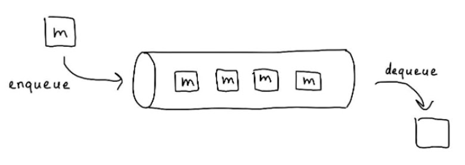

## Грейд 15

### Theory

#### Функциональное программирование

Система Лямбда-исчисления по сути была языком программирования для одной из воображаемых машин. Она была основана на функциях, которые  
принимают в качестве аргументов функции, и возвращают функцию. Такая функция была обозначена греческой буквой Лямбда λ,  
что дало название всей системе. В данном контексте лямбда — это функция. А греческая буква используется для удобства математической записи.  
List Processing language (Lisp). Lisp задумывался как имплементация Лямбда-исчисления  

Функциональное программирование — это практическая реализация идей Алонзо Чёрча. Не все идеи Лямбда-исчисления  
переросли в практическую сферу, так как лямбда-исчисления не учитывали физических ограничений.  
Тем не менее, как и ОО программирование, функциональное программирование — это набор идей, а не набор четких указаний.  

Функция — это базовый элемент функционального программирования. Функции используются почти для всего,  
даже для простейших расчётов. Даже переменные заменяются функциями. В функциональном программировании переменные — это  
просто синонимы (alias) для выражений (чтобы нам не пришлось писать всё в одну строку). Их нельзя изменять.  
В каждую переменную можно записать только один раз.  

Оказывается, что функциональные программы могут хранить состояние, только они не используют для этого переменные.  
Они используют функции. Состояние хранится в параметрах функции, в стеке.  
Если хотите сохранить состояние, чтобы потом изменить его через время, то нужно написать рекурсивную функцию.  

Так как в ФП каждый символ является неизменяемым, то функции не имеют побочных действий. Вы не можете менять  
значения переменных, к тому же функция не может поменять значение вне своей области видимости, и тем самым повлиять  
на другие функции (как это может случится с полями класса или глобальными переменными). Это означает, что  
единственный результат выполнения функции — это возвращаемое значение. А единственное, что может повлиять на  
возвращаемое значение — это аргументы, передаваемые в функцию.  

В ФП ситуация намного проще — если возвращаемое значение неправильное, то оно всегда будет неправильным, не зависимо от  
того, какие куски кода выполнялись прежде.  

Функциональная программа сразу готова к распараллеливанию без каких-либо изменений. Вам не придётся задумываться  
о deadlock-ах или состояниях гонки (race conditions) потому что вам не нужны блокировки! Ни один кусочек данных в  
функциональной программе не меняется дважды одним и тем же потоком или разными.  

В функциональной программе всё состояние хранится в стеке в виде аргументов функций. Это позволяет  
значительно упростить развёртывание по горячему! По сути всё что нужно сделать — это вычислить  
разницу между кодом на рабочем сервере и новой версией, и установить изменения в коде.  
Остальное будет сделано языковыми инструментами автоматически!  

Функции, которые оперируют функциями (принимают их в качестве аргументов) называются функциями высшего порядка  

Функциональная программа — программа, состоящая из чистых функций.  
Функция f является чистой если выражение f(x) является ссылочно прозрачным для всех ссылочно прозрачных x  
Ссылочная прозрачность — свойство, при котором замена выражения на  
вычисленный результат этого выражения не изменяет желаемых свойств программы  

В общем и целом, ФП направлено на то, чтобы можно было судить о поведении функции наблюдая только её одну  

```
//Rust

fn main() {
    let _ = print!("Hello ");
    println!("world!");
}
// Hello world!

//Haskell
main :: IO ()
main = do
  let _ = print "Hello "
  print "world!"
  
// world
```

#### CI/CD

##### Определения

CI - continuous integration - минимизировать расхождение веток (отсутствие долгоживущих веток)  
CD - continuous delivery    - серия практик, направленных на то, чтобы обновления программного обеспечения происходили практически постоянно  
CD - continuous deployment  - запуск всех этапов сборки и автоматический деплой на продакшн  

  

##### Плюсы и минусы ci/cd

Плюсы
- Одинаковый пайплайн для всех разработчиков
- Уменьшение человеческого фактора "если что-то забыли запустить"
- Автоматизация процессов
- Мониторинг ошибок
- Уменьшение рисков при ошибках (автоматический откат)
- Параллельный запуск множества сборок

Минусы
- Усложнение процесса разработки (развертывание и поддержка ci/cd)
- Покупка дополнительных ресурсов для runner`ров

##### Реализация ci/cd на примере gitlab ci.  
  

1. Build
 - Сборка всех необходимых образов
2. Test
 - Прогон всех тестов
 - Прогон линтера и анализатора кода
3. Deploy
 - Сборка prod образов
4. Production
 - Отправка prod образов на сервер

Если произошла ошибка на каком либо этапе, сборка останавливается и изменения не попадут на  
следующий этап (или прод сервер).  

При деплое изменений структуры БД следует учитывать ее обратную совместимость с кодом. Миграции не принято откатывать.  
Не следует удалять что либо из БД (возможно через год или два предварительно сложив в архивную таблицу).  


### Language

#### DDD Services
Сервисный слой (Service layer) — это шаблон проектирования, который инкапсулирует бизнес логику вашего приложения и  
определяет границу и набор допустимых операций с точки зрения взаимодействующих с ним клиентов.  

Если простыми словами, то вы сосредотачиваете логику вашего приложения в одном (или нескольких) классе-сервисе.

Сервис может вызывать методы репозитория, но не должен напрямую менять/запрашивать данные из хранилища

#### DDD Repositories

Репозиторий - это слой абстракции, инкапсулирующий в себе всё, что относится к способу хранения данных.  
Назначение: Разделение бизнес-логики от деталей реализации слоя доступа к данным.  

Применение данного паттерна не предполагает создание только одного объекта репозитория во всем приложении.  
Хорошей практикой считается создание отдельных репозиториев для каждого бизнес-объекта или контекста,  
например: OrdersRepository, UsersRepository, AdminRepository.  

Репозиторий - это высокоуровневая абстракция доступа к данным. Интерфейс каждого конкретного репозитория  
(контракт) определяется в слое бизнес-логики наряду с классами предметной области. Реализация каждого репозитория  
находится в слое доступа к данным DAL. Соответственно DAL состоит из реализации каждого репозитория,  
ORM-специфичных классов, сущностей, классов-сопоставлений (mapping), контекстов данных и т.д.  

#### 2й язык: Основы

### Framework
#### 2й язык: Обзор фреймворков
В golang не принято использовать крупные фреймворки. Зачастую проект на go является точечным микросервисом  
и большую часть вещей (логгирование, архитектура, методы работы с БД) реализуются непосредственно в проекте.  
Лучшей практикой может быть создание "проекта-шаблона", где будут реализованы все дефолтные методы принятые в компании.  
Далее их можно подключить через модули по надобности.  

### Storage
#### Триггеры

В PL/pgSQL можно создавать триггерные процедуры, которые будут вызываться при изменениях данных или событиях в базе  
данных. Триггерная процедура создаётся командой CREATE FUNCTION, при этом у функции не должно быть аргументов, а типом  
возвращаемого значения должен быть trigger (для триггеров, срабатывающих при изменениях данных) или event_trigger  
(для триггеров, срабатывающих при событиях в базе). Для триггеров автоматически определяются специальные локальные  
переменные с именами вида TG_имя, описывающие условие, повлёкшее вызов триггера.  

### DB
#### PostgreSQL Создание процедур и триггеров

```SQL
CREATE TRIGGER t_user
AFTER INSERT OR UPDATE OR DELETE ON users FOR EACH ROW EXECUTE PROCEDURE add_to_log();
```

```SQL
CREATE OR REPLACE FUNCTION add_to_log() RETURNS TRIGGER AS $$
DECLARE
    mstr varchar(30);
    astr varchar(100);
    retstr varchar(254);
BEGIN
    IF TG_OP = 'INSERT' THEN
        astr = NEW.name;
        mstr := 'Add new user ';
        retstr := mstr || astr;
        INSERT INTO logs(text,added) values (retstr,NOW());
        RETURN NEW;
    ELSIF TG_OP = 'UPDATE' THEN
        astr = NEW.name;
        mstr := 'Update user ';
        retstr := mstr || astr;
        INSERT INTO logs(text,added) values (retstr,NOW());
        RETURN NEW;
    ELSIF TG_OP = 'DELETE' THEN
        astr = OLD.name;
        mstr := 'Remove user ';
        retstr := mstr || astr;
        INSERT INTO logs(text,added) values (retstr,NOW());
        RETURN OLD;
    END IF;
END;
$$ LANGUAGE plpgsql;
```
### Frontend
#### Описание системы сборки по выбору

**webpack** - система сборки, которая предоставляет не только бандлинг (компоновку) модулей, но и может выполнять задачи,  
которыми занимаются Gulp/Grunt. К тому же, вебпак не ограничивается JavsScript-файлами, он может работать с другой  
статикой вроде CSS, картинок, html-компонентов и др. Вебпак также поддерживает очень полезную фичу — code splitting  
(разбиение кода). Большое приложение можно разбить на куски, которые загружаются по мере необходимости.  

webpack берет модули с зависимостями и генерирует статические ресурсы, которые представляют эти модули  

**webpack.config.js**
```js
module.exports = {
    context: __dirname,
    devtool: "source-map",
    entry: "./js/profile.js",
    output: {
        path: __dirname + "/dist",
        filename: "bundle.js"
    },
    module: {
        loaders: [
            {test: /\.css$/, loader: 'style!css!'}
        ]
    },
    devServer: {
        inline: true,
        port: 10000
    },
}
```


### Misc
#### Очереди: Apache Kafka и RabbitMQ

Простейшее определение очереди на уровне структур — это средство коммуникации при помощи сообщений.  
Мы кладем сообщение в очередь, а кто-то другой его оттуда достает:  



Очереди обеспечивают распределение ресурсов, репликацию сообщений, отказоустойчивость, надёжность передачи, гарантию  
доставки и коммуникацию микросервисов.  


Продюсеры (производитель) кладут задачу в очередь, а консьюмеры(потребитель) забирает задачу.  

**Apache Kafka**
Apache Kafka реплицированный шардированный лог сообщений для стриминга. Отправка организуется по принципу  
publish subscribe. Сообщения сохраняются на диск и записываются в один лог. У Kafka ограниченное количество  
консьюмеров, на одном логе (партиции) может быть строго один консьюмер из одной консьюмер-группы. В отличие от  
классических брокеров лог Kafka неизменен. В каком порядке сообщения записаны, в таком и остаются. Отсюда появляется  
строгая упорядоченность (FIFO). Сообщения не удаляются после обработки. Если часть сообщений в вашей системе была  
обработана некорректно, можно проиграть лог заново.  

Kafka:
- Чаще всего используют для анализа данных, логирования, метрики, аудита, производительного процессинга потоковых данных и репликации данных.
- Прекрасно интегрируется со всей экосистемой Apache и горизонтально масштабируется
- На ней сложно создавать обычные решения, типа роутинга.
- Из-за сложной архитектуры ее долго поднимать.

**RabbitMQ**
RabbitMQ традиционный брокер очередей с поддержкой протокола AMQP, MQTT и STOMP. В отличие от Kafka у него нет  
ограничений на количество потребителей. К одной очереди можно подключить любое их количество, и они будут  
быстрее обрабатывать сообщения. Есть несколько вариантов хранения: память, диск, репликация. Можно даже использовать  
кворум для сохранения сообщений (кворумные очереди).  

Основной сценарий: традиционный pub/sub брокер. Его часто используют в качестве слоя шины данных между разными  
микросервисами. RabbitMQ довольно прост в освоении, но сложен в настройке отказоустойчивых сценариев. Настроить  
гарантированное хранилище можно, но для создания надежной распределенной системы проще использовать другие инструменты.  


В очередях бывает нужна **приоритизация сообщений**. Например, в той же **Kafka** ее нет потому, что каждое сообщение  
автоматически помещается в конец топика и будет лежать на том месте, на которое пришло. Сообщения в **Kafka** нельзя  
переупорядочить.  