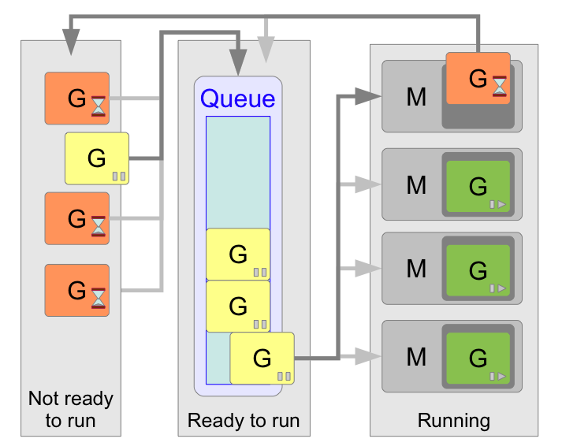

## Грейд 16

### Theory
#### Многопоточность
Многопото́чность (англ. Multithreading) — свойство платформы (например, операционной системы, виртуальной машины)  
или приложения, состоящее в том, что процесс, порождённый в операционной системе, может состоять из нескольких потоков,  
выполняющихся «параллельно», то есть без предписанного порядка во времени. При выполнении некоторых задач такое  
разделение может достичь более эффективного использования ресурсов вычислительной машины.  

На одно ядро процессора, в каждый момент времени, приходится одна единица исполнения.  
То есть одноядерный процессор может обрабатывать команды только последовательно, по одной за раз (в упрощенном случае).  
Однако запуск нескольких параллельных потоков возможен и в системах с одноядерными процессорами.  
В этом случае система будет периодически переключаться между потоками, поочередно давая выполняться  
то одному, то другому потоку. Такая схема называется псевдо-параллелизмом.  

Каждый процесс имеет хотя бы один выполняющийся поток. Тот поток, с которого начинается выполнение программы, называется главным.  

Горутина (goroutine) — это функция, выполняющаяся конкурентно с другими горутинами в том же адресном пространстве.  
В среднем можно рассчитывать примерно на 4,5kb на горутину. То есть, например, имея 4Gb оперативной памяти,  
вы сможете содержать около 800 тысяч работающих горутин.  

Цель планировщика (scheduler) в том, чтобы распределять готовые к выполнению горутины (G) по свободным машинам (M).  

  

Блокировки
Блокировки работают очень просто: прежде чем писать в переменную, поток должен захватить семафор.  
Остальные потоки будут вынуждены ждать, пока семафор не освободится, и лишь потом один из других потоков снова  
захватит семафор, и так далее.  

Программная транзакционная память  
(англ. software transactional memory, SТМ) представляет собой механизм управления параллелизмом, аналогичный  
механизму транзакций баз данных для управления доступом к совместно используемой памяти в параллельных вычислениях.  
Это альтернатива для синхронизации на основе блокировки. Транзакция в этом контексте является частью кода,  
который выполняет считывание и запись в разделяемую (совместно используемую) память. Считывание и запись логически  
происходит в единичный момент времени, а промежуточные состояния невидимы для других (результативных) транзакций.  

Пусть у каждого потока будет своя куча, где он будет хранить свои данные,а если нужно обменяться информацией —  
пусть шлет сообщение другому потоку. Такая модель реализована в Go и Erlang.  

#### Сравнение языков программирования

### Language 2й язык:
#### Применение
#### Многопоточность

### Framework
#### 2й язык: Описание фреймворка по выбору

### DB
#### Elasticsearch
#### Couchbase

### Frontend
#### Описание фреймворка по выбору

### Misc
#### Power BI
