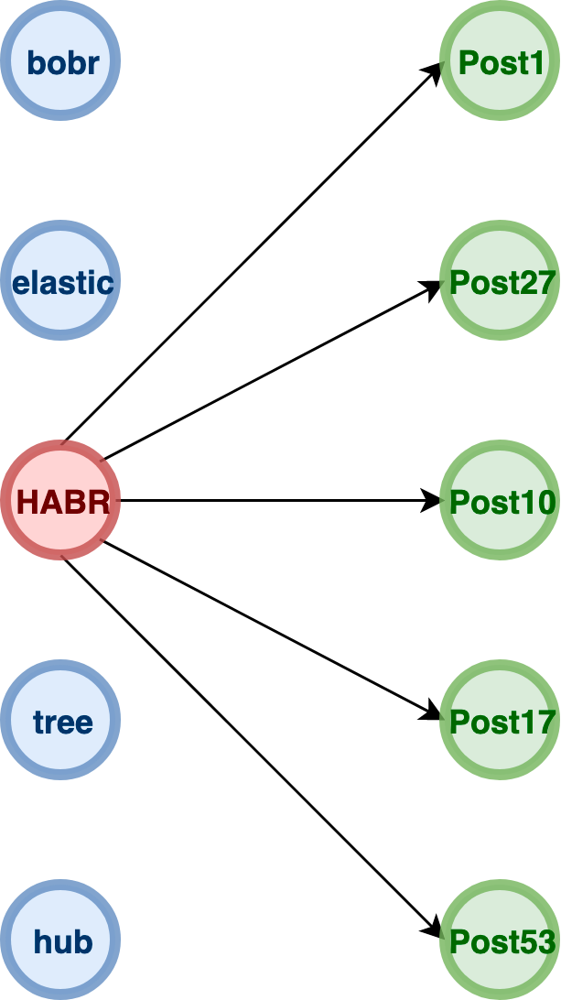
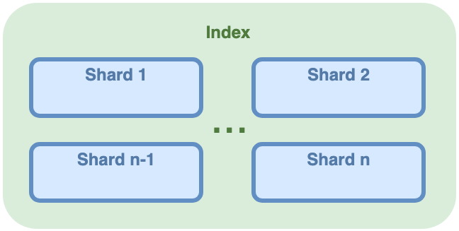

## Грейд 16

### Theory
#### Многопоточность
Многопото́чность (англ. Multithreading) — свойство платформы (например, операционной системы, виртуальной машины)  
или приложения, состоящее в том, что процесс, порождённый в операционной системе, может состоять из нескольких потоков,  
выполняющихся «параллельно», то есть без предписанного порядка во времени. При выполнении некоторых задач такое  
разделение может достичь более эффективного использования ресурсов вычислительной машины.  

На одно ядро процессора, в каждый момент времени, приходится одна единица исполнения.  
То есть одноядерный процессор может обрабатывать команды только последовательно, по одной за раз (в упрощенном случае).  
Однако запуск нескольких параллельных потоков возможен и в системах с одноядерными процессорами.  
В этом случае система будет периодически переключаться между потоками, поочередно давая выполняться  
то одному, то другому потоку. Такая схема называется псевдо-параллелизмом.  

Каждый процесс имеет хотя бы один выполняющийся поток. Тот поток, с которого начинается выполнение программы, называется главным.  

Горутина (goroutine) — это функция, выполняющаяся конкурентно с другими горутинами в том же адресном пространстве.  
В среднем можно рассчитывать примерно на 4,5kb на горутину. То есть, например, имея 4Gb оперативной памяти,  
вы сможете содержать около 800 тысяч работающих горутин.  

Цель планировщика (scheduler) в том, чтобы распределять готовые к выполнению горутины (G) по свободным машинам (M).  

  

Блокировки
Блокировки работают очень просто: прежде чем писать в переменную, поток должен захватить семафор.  
Остальные потоки будут вынуждены ждать, пока семафор не освободится, и лишь потом один из других потоков снова  
захватит семафор, и так далее.  

Программная транзакционная память  
(англ. software transactional memory, SТМ) представляет собой механизм управления параллелизмом, аналогичный  
механизму транзакций баз данных для управления доступом к совместно используемой памяти в параллельных вычислениях.  
Это альтернатива для синхронизации на основе блокировки. Транзакция в этом контексте является частью кода,  
который выполняет считывание и запись в разделяемую (совместно используемую) память. Считывание и запись логически  
происходит в единичный момент времени, а промежуточные состояния невидимы для других (результативных) транзакций.  

Пусть у каждого потока будет своя куча, где он будет хранить свои данные,а если нужно обменяться информацией —  
пусть шлет сообщение другому потоку. Такая модель реализована в Go и Erlang.  

#### Сравнение языков программирования

**Следует научиться быстро осваивать новые языки.**  

Помимо лингвистических знаний в быстро меняющемся мире **важны знания фундаментальные**.  
Те, что не потеряют своей актуальности и через десять лет, и через двадцать.  

Очевидная база для программистов — алгоритмы и структуры данных. Она вызывает серьёзные споры, потому что у  
многих программистов эти знания зачастую не востребованы. Как говорят в интернет-баталиях, чтобы пилить круды,  
алгоритмы не нужны. И в этом есть доля истины.  

Языки программирования похожи друг на друга. Они образуют целые семейства с общими идеями, а иногда даже и общим  
синтаксисом. Скажем, C++, Java и C# очень похожи друг на друга не только концептуально, но и синтаксически.  

Fortran был императивным, то есть состоял из императивов. Программа на императивном языке программирования — это  
последовательность команд, которые выполняет компьютер.  

LISP — положил начало функциональным языкам. Вместо команд здесь используют примитивные чистые функции,  
которые комбинируют в чуть более крупные функции, а те, в свою очередь — в ещё более крупные.  
В конечном счёте, программа на функциональном языке — это одна большая функция, которую компьютер и вычисляет.  

Императивным языки — Pascal, C, C++, Java, C#, Python, Go, PHP, Rust. 
Функциональные языки — Haskell, Scala, Erlang, Clojure, Scheme, F#.

Современные языки поддерживают сразу несколько парадигм. Лямбда-функции, являющиеся основой основ функциональных  
языков, сейчас можно встретить во многих императивных языках, включая C++.  

В императивных языках долгое время существовало разделение на код и данные, при этом код управлял данными.  
Языки такого рода сейчас называют процедурными, к ним, например, относят Fortran, Pascal и C.  

В противовес им, в объектно-ориентированных языках программист размещает код и данные вместе, и  
называет объектом. К таким языкам относят C++, Object Pascal, Java, C#, JavaScript, PHP. 

Языки также классифицируют по тому, как они работают с типами данных. Разделяют статически типизированные и  
динамически типизированные языки, а также языки с сильной и слабой типизацией.  

Ещё один признанный способ классификации — разделение языков на низкоуровневые и высокоуровневые.  

Языки низкого уровня используют в системном программировании и разработке игр, то есть там, где требуется  
высокая производительность кода и экономия ресурсов. К ним относят C, C++, Rust и, в какой-то мере, Go.  

Языки высокого уровня повышают производительность программиста. Ему не приходится распределять память или  
вручную обрабатывать строки, он занимается решением бизнес-задач. В категорию высокоуровневых  
входят Java, C#, Scala, Python, Ruby.  

Если языку программирования не хватает скорости, часть программы пишут на низкоуровневом языке и вызывают  
этот быстрый код из языка высокого уровня. Подобное смешение возможно за счёт техник, которые в целом называют  
Foreign Function Interface (FFI), или Интерфейс Внешних Функций.  

### Language 2й язык:
#### Применение
Go нужен для того, чтобы проектировать robust software (надежный).  

Роб Пайк
```
Фишка в том, что наши программисты гуглеры, а не ученые. Это обычно молодые, только выпустившиеся пацаны, которые  
возможно выучили Java, возможно даже C/C++ и может быть Python. Они не в состоянии понимать пробздетый язык,  
но мы все равно хотим, чтобы они делали хороший софт. Таким образом, мы даем им легкопонимаемый язык,  
к которому они быстро привыкнут.
```

Go это фантастический инструмент для менеджмента, лучше не придумать: моментально загоняем всех программистов в  
рамки go-fmt (никто не сможет пропихнуть свой стиль форматирования), забираем у них любые абстракции сложнее  
интерфейса и получается такой конвеер кода, в котором developer is just another brick in the wall.  

**Зачем нужен Go?**

С технической стороны, ниша у Go довольно скромная: сеть, утилиты, бэкенды. Если у вас сложные сети или много нод,  
которые надо как-то навороченным образом оркестрировать, то Go это хороший выбор (судя по опыту CloudFlare).  
Если вы хотите сделать какую-то классную консольную утилиту, вроде докера или консула, то Go тоже нормульок подойдет  
(судя по опыту оных). Ну и в конце-концов. Если вам нужен быстрый и в принципе, эффективный бэкенд, то тоже можно  
выбрать Go. Я не представляю, как народ пишет бизнес-логику на Go, но как-то пишут же! Короче, тут все довольно сложно.  
С одной стороны, делать CRUD в Go это достаточно болезненно, с другой стороны есть 350 разных роутеров и фреймворков,  
которые здорово облегчают работу.  

#### Многопоточность

Каналы позволяют горутинам обмениваться данными. Это своеобразная труба, через которую горутины могут посылать и  
принимать информацию от других горутин.  
Чтение и запись в канал осуществляется при помощи оператора-стрелочки (<-), который указывает направление движения  
данных.  

```
myFirstChannel := make(chan string)
myFirstChannel <- "hello" // Записать в канал
myVariable := <- myFirstChannel // Прочитать из канала
```

```
func main() {
 theMine := [5]string{“ore1”, “ore2”, “ore3”}
 oreChan := make(chan string)
 // Искатель руды
 go func(mine [5]string) {
  for _, item := range mine {
   oreChan <- item //отправка
  }
 }(theMine)
 // Добытчик руды
 go func() {
  for i := 0; i < 3; i++ {
   foundOre := <-oreChan //получение
   fmt.Println(“Miner: Received “ + foundOre + “ from finder”)
  }
 }()
 <-time.After(time.Second * 5) // снова не обращайте внимания
}
```

Блокировки  

В некоторых ситуациях при работе с каналами горутина может быть заблокирована. Это необходимо, чтобы  
горутины могли синхронизироваться друг с другом прежде чем они начнут или продолжат работу.  

Блокировка при записи  
Когда горутина (гофер) посылает данные в канал, она блокируется до тех пор, пока другая горутина не прочитает данные  
из канала.  

Блокировка при чтении  
Аналогично блокировке при записи в канал, горутина может быть заблокирована при чтении из канала до тех пор,  
пока в него ничего не запишут.  

Буферизованные каналы  
В буферизоваванный канал мы можем послать несколько фрагментов данных, без необходимости чтения их другой горутиной.  
Это основное отличие от небуферизованных каналов.  

### Framework
#### 2й язык: Описание фреймворка по выбору

### DB

#### Elasticsearch
Elasticsearch — поисковый движок с json rest api, использующий Lucene и написанный на Java.  
Elasticsearch это документоориентированная база данных  

ES автоматически создал индекс blog и тип post. Можно провести условную аналогию: индекс — это база данных,  
а тип — таблица в этой БД. Каждый тип имеет свою схему — mapping, также как и реляционная таблица.  
Mapping генерируется автоматически при индексации документа  

Многие поисковые системы, поиск происходит по всему тексту проиндексированных страниц,  
а не по отдельным полям, тегам или заголовкам. Это называется полнотекстовым поиском.  

  

Такой индекс называется обратным индексом и используется для полнотекстового поиска.  

  
Shard в Elasticsearch — это логическая единица хранения данных на уровне базы, которая является отдельным  
экземпляром Lucene.  

Index — это одновременно и распределенная база и механизм управления и организации данных, это именно логическое  
пространство. Индекс содержит один или более шардов, их совокупность и является хранилищем.  

Каждый запущенный экземпляр Elasticsearch является отдельным узлом(node). Cluster — это совокупность определенных нод.  
Когда вы запускаете один экземпляр ваш кластер будет состоять из одной ноды.  

#### Couchbase


### Frontend
#### Описание фреймворка по выбору


### Misc
#### Power BI
