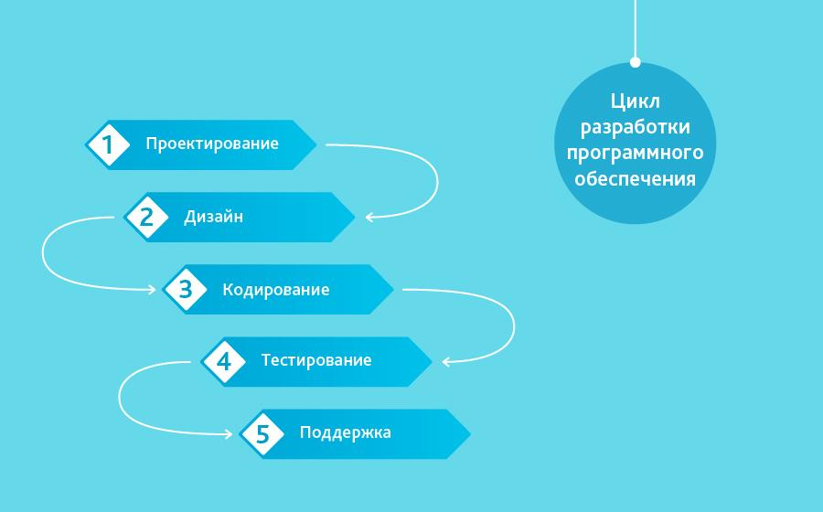
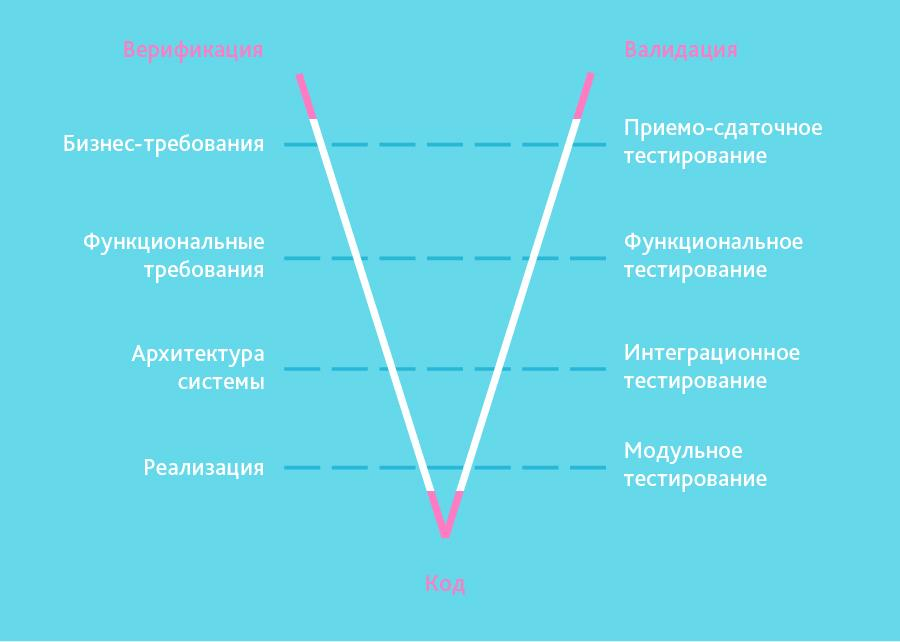
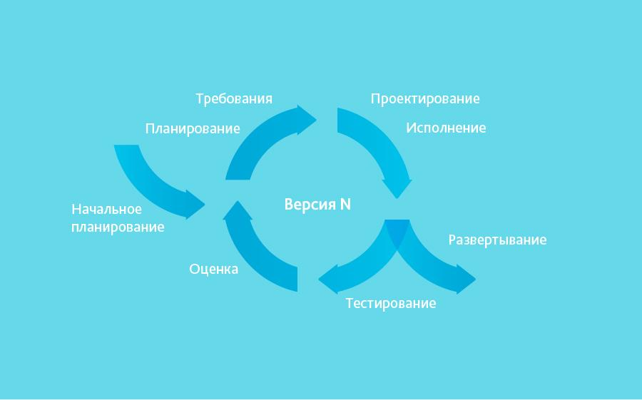
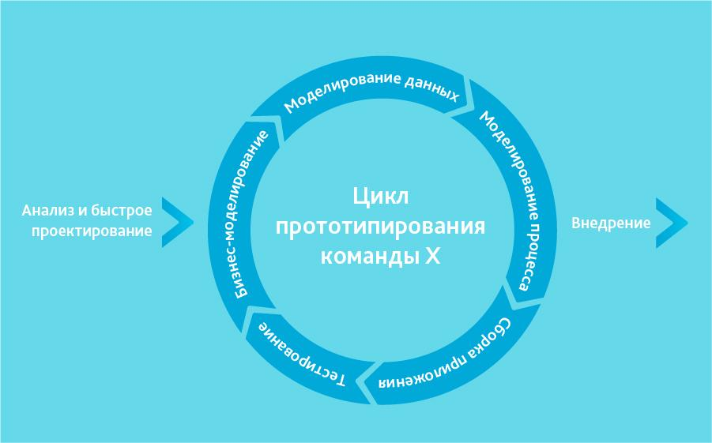
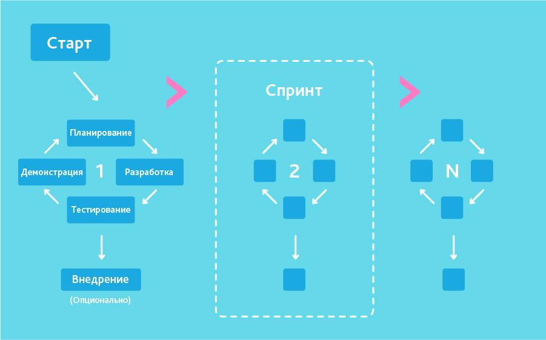
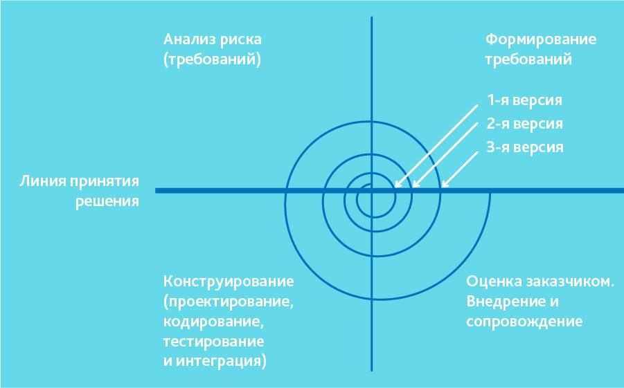

## Грейд 2  

### Theory  

#### Цикл разработки web‑приложений  
- Планирование
- Дизайн
- Разработка
- Тестирование
- Поддержка

#### Методологии разработки
- «Waterfall Model» (каскадная модель или «водопад»)  
  
- «V-Model»  
  
- «Incremental Model» (инкрементная модель)  
  
- «RAD Model» (rapid application development model или быстрая разработка приложений)  
  
- «Agile Model» (гибкая методология разработки)  
  
- «Iterative Model» (итеративная или итерационная модель)  
  
- «Spiral Model» (спиральная модель)  
  

#### Минимально жизнеспособный продукт (MVP)  
MVP – это не продукт, а процесс.  
MVP это процесс, где вы повторяете все раз за разом: определяете свои гипотезы, находите самые быстрые варианты их  
проверки и используете полученные результаты для изменения стратегии.  
Единственный путь проверить гипотезу – это дать продукт потенциальному клиенту как можно быстрее. И если вы будете  
делать это постоянно, то вы поймёте, что большинство гипотез проваливаются. И вам придётся каждый раз возвращаться  
к началу, тестируя разные гипотезы.  
В этом мире, кто быстрее находит ошибки и исправляет их, тот и становится победителем. Некоторые люди называют эту  
философию «Fail fast» (проваливайся быстро).  

#### Компьютерная сеть  
Компьютерная сеть (вычислительная сеть) — система, обеспечивающая обмен данными между вычислительными устройствами —  
компьютерами, серверами, маршрутизаторами и другим оборудованием или программным обеспечением. Для передачи информации  
могут быть использованы различные среды. Помимо совокупности физических устройств и физических средств передачи данных,  
вычислительная сеть может быть оверлейной или виртуальной, т.е. логически самостоятельной выделенной сетью использующей  
ресурсы другой физической сети - вычислительной (например Интернет), телефонной сети (в т.ч. ТФОП) и/или среды передачи данных.  

### Language  

#### PHP Пользовательские функции  
```php
//Пример
function doSomeThing(int $some): int 
{
    return $some * 10;
}
```

#### Стандарты PHP (PSR)  
@inheritdoc  
#### PHPDoc  
```php
/**
* пример Doc коммента
* @var $myVar 
*/
```
#### PHP Встроенные функции работы с датой и временем  
#### PHP Встроенные функции работы с файловой системой  
#### PHP Встроенные функции поддержки языков и кодировок  
@inheritdoc  

### Storage  

#### Понятие о базе данных  
БД - это организованная структура, предназначенная для хранения, изменения и обработки взаимосвязанной информации  

#### Понятие о СУБД  
Систе́ма управле́ния ба́зами да́нных, сокр. СУБД (англ. Database Management System, сокр. DBMS) — совокупность программных  
и лингвистических средств общего или специального назначения, обеспечивающих управление созданием и использованием баз данных.  
СУБД — комплекс программ, позволяющих создать базу данных (БД) и манипулировать данными (вставлять, обновлять, удалять и выбирать).  
Система обеспечивает безопасность, надёжность хранения и целостность данных, а также предоставляет средства для  
администрирования БД.  

### DB  
#### PostgreSQL Типы данных  
#### PostgreSQL Синтаксис запроса SQL  
#### PostgreSQL Простые выборки из таблиц  
@inheritdoc  

### Frontend  
#### HTML Таблицы  
#### HTML Формы  
#### HTML iFrame  
@inheritdoc  

### DevOps  
#### pipe (конвейер)  
#### pv  
#### Команды для работы с файлами  
@inheritdoc  

### Git  

#### Метки  
```git
$ git tag

#Аннотированные метки
$ git tag -a v1.4 -m 'my version 1.4'
```
#### Работа с удалёнными репозиториями  

```git
$ git remote -v

origin	https://github.com/schacon/ticgit (fetch)
origin	https://github.com/schacon/ticgit (push)

#git remote add <shortname> <url>
$ git remote add pb https://github.com/paulboone/ticgit

#Для получения данных из удалённых проектов, следует выполнить
$ git fetch [remote-name]

#git pull, как правило, извлекает (fetch) данные с сервера, 
#с которого вы изначально склонировали, 
#и автоматически пытается слить (merge) 
#их с кодом, над которым вы в данный момент работаете.
```

### Misc  
@inheritdoc  