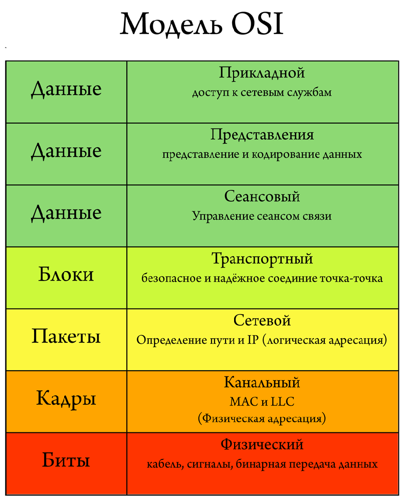
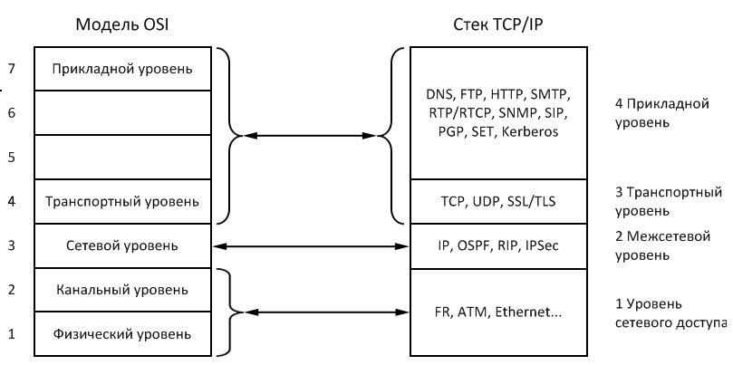

## Грейд 5  

### Theory  

#### Чистые функции  
Детерминированная функция всегда возвращает одинаковое значение при определённом вводе (аргументы).  

Когда функция детерминированная и не имеет побочных эффектов, мы называем её "чистой" функцией. Чистые функции:  
- проще читать
- проще отлаживать
- проще тестировать
- не зависят от порядка, в котором они вызываются
- просто запустить параллельно (одновременно)

#### Рефакторинг  
Рефакторинг — это контролируемый процесс улучшения кода, без написания новой функциональности. Результат  
рефакторинга — это чистый код и простой дизайн.  

Пошаговые изменения, сопровождаемые частыми запусками тестов — это то, то делает процесс рефакторинга эффективным и безопасным.  

#### Идентификация, аутентификации, авторизация  
Идентификация — это процедура распознавания субъекта по его идентификатору  
(проще говоря, это определение имени, логина или номера).  

Аутентификация – это процедура проверки подлинности  
(пользователя проверяют с помощью пароля, письмо проверяют по электронной подписи и т.д.)  

Авторизация – это предоставление доступа к какому-либо ресурсу (например, к электронной почте).  

#### Виртуализация  
Виртуализа́ция — предоставление набора вычислительных ресурсов или их логического объединения, абстрагированное от  
аппаратной реализации, и обеспечивающее при этом логическую изоляцию друг от друга вычислительных процессов,  
выполняемых на одном физическом ресурсе.  

Примером использования виртуализации является возможность запуска нескольких операционных систем на одном компьютере:  
при том каждый из экземпляров таких гостевых операционных систем работает со своим набором логических ресурсов  
(процессорных, оперативной памяти, устройств хранения)  

### Language  

#### Lambda‑функции  
Анонимные функции, также известные как замыкания (closures), позволяют создавать функции, не имеющие определенных  
имен. Они наиболее полезны в качестве значений callback-параметров, но также могут иметь и множество других применений.  
```php
<?php
$greet = function($name) {
    printf("Привет, %s\r\n", $name);
};

$greet('Мир');
$greet('PHP');

// Привет, Мир
// Привет, PHP

$message = 'привет';

// Наследуем $message
$example = function () use ($message) {
    printf("Отправь, %s\r\n", $message);
};
$example();
// Отправь, привет

?>
```

#### PHP: доступ через HTTP (curl, file_get_contents)  
```php
<?php
//cUrl
$url = 'google.com';
$ch = curl_init();
curl_setopt($ch, CURLOPT_URL, $url);
curl_setopt($ch, CURLOPT_HEADER, TRUE);
curl_setopt($ch, CURLOPT_NOBODY, TRUE); // remove body
curl_setopt($ch, CURLOPT_RETURNTRANSFER, TRUE);
$head = curl_exec($ch);
$httpCode = curl_getinfo($ch, CURLINFO_HTTP_CODE);
curl_close($ch);

//file_get_contents
$homepage = file_get_contents('http://www.example.com/');
echo $homepage;
```

#### ООП в PHP Классы и объекты  
```php
<?php
//описываем класс

class Men
{
    //описываем свойства
    public string $name;

    //описываем методы
    public function sayHello()
    {
        return 'Hello';
    }
}

$men = new Men();
$men->name = 'Rick';
$men->sayHello();
```

### Framework  

#### Yii2 Жизненные циклы запроса и приложения и Yii2 Конфигурации приложения и Yii2 Структура приложения - обзор
@inheritdoc  

### Testing  

#### Основы тестирования  
#### Классификация тестов  
#### Принципы тестирования  
@inheritdoc  

### Storage  

#### Понятие о нормализации БД  
Нормализация это процесс организации данных в базе данных. Это включает создание таблиц и установку отношений между  
этими таблицами в соответствии с правилами, предназначенными для защиты данных и обеспечения большей гибкости базы  
данных за счет исключения избыточности и несогласованности зависимости.  

Существует несколько правил нормализации баз данных. Каждое правило называется "обычной формой". Если выполняется  
первое правило, база данных называется "Первая нормальная форма". Если выполняются первые три правила,  
база данных считается "третьей нормальной форме". Хотя возможны и другие уровни нормализации, Третья нормальная  
форма считается самым высоким уровнем, необходимым для большинства приложений.  

### DB  

#### PostgreSQL INSERT UPDATE DELETE  
#### PostgreSQL Группировка  
@inheritdoc  

### Frontend  

#### JS работа с DOM  
@inheritdoc  

### DevOps  

#### awk  
Команда awk - один из самых мощных инструментов для обработки и фильтрации текста  
```
$ awk опции 'условие {действие} условие {действие}'
$ echo 'one two three four' | awk '{print $1}'
//one
```

#### sed  
Команда sed - это потоковый редактор текста, работающий по принципу замены. Его можно использовать для поиска, вставки,  
замены и удаления фрагментов в файле.  
```
$ sed опции -e команды файл

//стройки с пятой по десятую
sed -n '5,10p' /etc/group
```

#### curl  
На самом деле, curl - это больше чем просто утилита командной строки для Linux или Windows. Это набор библиотек,  
в которых реализуются базовые возможности работы с URL страницами и передачи файлов.  
```
$ curl опции ссылка

//скачать файл
$ curl https://raw.githubusercontent.com/curl/curl/master/README.md

```


#### wget  
Это очень мощная утилита, способная работать по протоколам HTTP, HTTPS и FTP. Кроме того поддерживается  
работа через прокси.  
```
$ wget опции аддресс_ссылки

//скачать файл
$ wget http://ftp.gnu.org/gnu/wget/wget-1.5.3.tar.gz
```
#### http   

### Git  

#### Поиск  
```git
$ git grep -n gmtime_r

compat/gmtime.c:3:#undef gmtime_r
compat/gmtime.c:8:      return git_gmtime_r(timep, &result);

```

#### Просмотр разницы  
```git
$ git diff [<options>] [<commit>] [--] [<path>…​]
$ git diff [<options>] --cached [<commit>] [--] [<path>…​]
$ git diff [<options>] <commit> <commit> [--] [<path>…​]
$ git diff [<options>] <blob> <blob>
$ git diff [<options>] --no-index [--] <path> <path>
```

#### Спрятать и достать изменения  
```git
$ git stash
Saved working directory and index state \
  "WIP on master: 049d078 added the index file"
HEAD is now at 049d078 added the index file
(To restore them type "git stash apply")

$ git stash list
stash@{0}: WIP on master: 049d078 added the index file
stash@{1}: WIP on master: c264051 Revert "added file_size"
stash@{2}: WIP on master: 21d80a5 added number to log

$ git stash apply stash@{2}.
```

### Misc

#### API: назначение, состав, особенности  
API (Application programming interface) — это контракт, который предоставляет программа. «Ко мне можно обращаться так и  
так, я обязуюсь делать то и это».  

Контракт включает в себя:  

- саму операцию, которую мы можем выполнить,
- данные, которые поступают на вход,
- данные, которые оказываются на выходе (контент данных или сообщение об ошибке).

#### Линтеры  
первоначально — статический анализатор для языка программирования Си, который сообщал о подозрительных или непереносимых  
на другие платформы выражениях. В начале XXI века термин стал нарицательным для всех программ такого типа. Как инструмент  
программа лишь анализирует статический исходный код, не скомпилированный в отличие от отладчиков.  

#### Модель OSI  
Сетевая модель OSI (The Open Systems Interconnection model) — сетевая модель стека (магазина) сетевых протоколов  
OSI/ISO. Посредством данной модели различные сетевые устройства могут взаимодействовать друг с другом. Модель определяет  
различные уровни взаимодействия систем. Каждый уровень выполняет определённые функции при таком взаимодействии.  
  

#### Стек TCP/IP  
Transmission Control Protocol/Internet Protocol (TCP/IP) - это промышленный стандарт стека протоколов,  
разработанный для глобальных сетей.  
Стандарты TCP/IP опубликованы в серии документов, названных Request for Comment (RFC).  
Документы RFC описывают внутреннюю работу сети Internet. Некоторые RFC описывают сетевые сервисы или  
протоколы и их реализацию, в то время как другие обобщают условия применения. Стандарты TCP/IP всегда  
публикуются в виде документов RFC, но не все RFC определяют стандарты.  
  