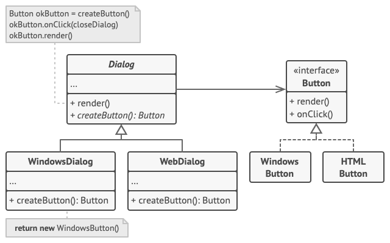
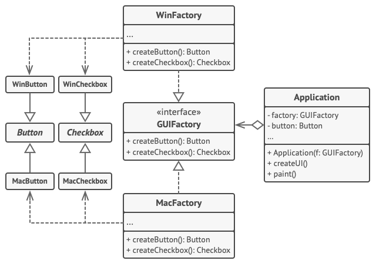
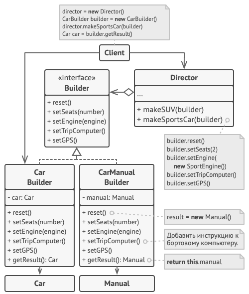

## Грейд 8

### Theory

#### Понятие о паттерне MVC
Model-View-Controller (MVC, «Модель-Представление-Контроллер», «Модель-Вид-Контроллер») — схема разделения данных  
приложения, пользовательского интерфейса и управляющей логики на три отдельных компонента:  
модель, представление и контроллер — таким образом, что модификация каждого компонента может осуществляться независимо.  

Модель (Model) предоставляет данные и реагирует на команды контроллера, изменяя своё состояние.  
Представление (View) отвечает за отображение данных модели пользователю, реагируя на изменения модели.  
Контроллер (Controller) интерпретирует действия пользователя, оповещая модель о необходимости изменений.  

Служит для отделения бизнес логики от ее представления.

#### Паттерны проектирования: порождающие
Эти паттерны отвечают за удобное и безопасное создание новых объектов или даже целых семейств объектов.

Фабричный метод  
Фабричный метод — это порождающий паттерн проектирования, который определяет общий интерфейс для создания объектов в  
суперклассе, позволяя подклассам изменять тип создаваемых объектов.  
  

Абстрактная фабрика  
Абстрактная фабрика — это порождающий паттерн проектирования, который позволяет создавать семейства связанных объектов,  
не привязываясь к конкретным классам создаваемых объектов.  
  

Строитель  
Строитель — это порождающий паттерн проектирования, который позволяет создавать сложные объекты пошагово. Строитель  
даёт возможность использовать один и тот же код строительства для получения разных представлений объектов.  
  

Прототип  
Прототип — это порождающий паттерн проектирования, который позволяет копировать объекты, не вдаваясь в  
подробности их реализации.  
  

Одиночка  
Одиночка — это порождающий паттерн проектирования, который гарантирует, что у класса есть только один  
экземпляр, и предоставляет к нему глобальную точку доступа.  

```php
<?php

namespace RefactoringGuru\Singleton\Conceptual;

/**
 * Класс Одиночка предоставляет метод `GetInstance`, который ведёт себя как
 * альтернативный конструктор и позволяет клиентам получать один и тот же
 * экземпляр класса при каждом вызове.
 */
class Singleton
{
    /**
     * Объект одиночки храниться в статичном поле класса. Это поле — массив, так
     * как мы позволим нашему Одиночке иметь подклассы. Все элементы этого
     * массива будут экземплярами кокретных подклассов Одиночки. Не волнуйтесь,
     * мы вот-вот познакомимся с тем, как это работает.
     */
    private static $instances = [];

    /**
     * Конструктор Одиночки всегда должен быть скрытым, чтобы предотвратить
     * создание объекта через оператор new.
     */
    protected function __construct() { }

    /**
     * Одиночки не должны быть клонируемыми.
     */
    protected function __clone() { }

    /**
     * Одиночки не должны быть восстанавливаемыми из строк.
     */
    public function __wakeup()
    {
        throw new \Exception("Cannot unserialize a singleton.");
    }

    /**
     * Это статический метод, управляющий доступом к экземпляру одиночки. При
     * первом запуске, он создаёт экземпляр одиночки и помещает его в
     * статическое поле. При последующих запусках, он возвращает клиенту объект,
     * хранящийся в статическом поле.
     *
     * Эта реализация позволяет вам расширять класс Одиночки, сохраняя повсюду
     * только один экземпляр каждого подкласса.
     */
    public static function getInstance(): Singleton
    {
        $cls = static::class;
        if (!isset(self::$instances[$cls])) {
            self::$instances[$cls] = new static;
        }

        return self::$instances[$cls];
    }

    /**
     * Наконец, любой одиночка должен содержать некоторую бизнес-логику, которая
     * может быть выполнена на его экземпляре.
     */
    public function someBusinessLogic()
    {
        // ...
    }
}

/**
 * Клиентский код.
 */
function clientCode()
{
    $s1 = Singleton::getInstance();
    $s2 = Singleton::getInstance();
    if ($s1 === $s2) {
        echo "Singleton works, both variables contain the same instance.";
    } else {
        echo "Singleton failed, variables contain different instances.";
    }
}

clientCode();
```

#### Кэширование
В сфере вычислительной обработки данных кэш – это высокоскоростной уровень хранения, на котором требуемый набор  
данных, как правило, временного характера. Доступ к данным на этом уровне осуществляется значительно быстрее,  
чем к основному месту их хранения. С помощью кэширования становится возможным эффективное повторное использование  
ранее полученных или вычисленных данных.  

### Language

#### PHP и проблема памяти
PHP является динамичным языком программирования. Это означает, что он выделяет довольно много памяти для переменной.  

Если сначала инициализировать переменную и потом присвоить ей null, то переменная не будет полностью уничтожена.  
Под нее остается выделенным еще 76 байт. достаточно прилично, если учесть, что ровно столько же выделяется и  
под переменные типа boolean, integer, float.   
Так что если вы хотите освободить память при помощи присвоения, то не является принципиальным присвоение именно null  
значения. Выражение $a=10000; даст тот же результат для расхода памяти.  
Для освобождения памяти используйте unset().  

Встречается заблуждение, что unset() является функцией, однако, это не верно. unset() — это языковая конструкция  
(как например if), о чем прямо сказано в документации, соответственно ее нельзя использовать для обращения  
через значение переменной.  

#### ООП в PHP Абстрактные классы
PHP поддерживает определение абстрактных классов и методов. Объекты классов, определенные, как абстрактные, не  
могут быть созданы, и любой класс, который содержит по крайней мере один абстрактный метод, должен быть определен,  
как абстрактный. Методы, объявленные абстрактными, несут, по существу, лишь описательный смысл и не могут  
включать реализацию.  

При наследовании от абстрактного класса, все методы, помеченные абстрактными в родительском классе, должны быть  
определены в дочернем классе; кроме того, область видимости этих методов должна совпадать (или быть менее строгой).  

```php
<?php
abstract class AbstractClass
{
   /* Данный метод должен быть определён в дочернем классе */
    abstract protected function getValue();
    abstract protected function prefixValue($prefix);

   /* Общий метод */
    public function printOut() {
        print $this->getValue() . "\n";
    }
}

class ConcreteClass1 extends AbstractClass
{
    protected function getValue() {
        return "ConcreteClass1";
    }

    public function prefixValue($prefix) {
        return "{$prefix}ConcreteClass1";
    }
}
```

#### ООП в PHP Интерфейсы
Интерфейсы объектов позволяют создавать код, который указывает, какие методы должен реализовать класс, без  
необходимости определять, как именно они должны быть реализованы.  
Интерфейсы объявляются так же, как и обычные классы, но с использованием ключевого слова interface  
вместо class. Тела методов интерфейсов должны быть пустыми.  
Все методы, определенные в интерфейсах должны быть общедоступными, что следует из самой природы интерфейса.  

Для реализации интерфейса используется оператор implements. Класс должен реализовать все методы, описанные в  
интерфейсе, иначе произойдет фатальная ошибка. При желании классы могут реализовывать более  
одного интерфейса, разделяя каждый интерфейс запятой.  

```php
<?php

// Объявим интерфейс 'iTemplate'
interface iTemplate
{
    public function setVariable($name, $var);
}

class BadTemplate implements iTemplate
{
    private $vars = array();
  
    public function setVariable($name, $var)
    {
        $this->vars[$name] = $var;
    }
}
```

#### PHP Паттерны проектирования: "одиночка"
@inheritdoc  

### Framework

#### Yii2 Виджеты
Виджеты представляют собой многоразовые строительные блоки, используемые в представлениях для создания сложных и  
настраиваемых элементов пользовательского интерфейса в рамках объектно-ориентированного подхода.  

```php
<?php
use yii\bootstrap\DatePicker;
?>

<?php echo DatePicker::widget(['name' => 'date']) ?>
```

Создание Виджетов  
Для того, чтобы создать виджет, следует унаследовать класс yii\base\Widget и переопределить  
методы yii\base\Widget::init() и/или yii\base\Widget::run(). Как правило, метод init() должен содержать код,  
выполняющий нормализацию свойств виджета, а метод run() - код, возвращающий результат рендеринга виджета.  

```php
namespace app\components;

use yii\base\Widget;
use yii\helpers\Html;

class HelloWidget extends Widget
{
    public $message;

    public function init()
    {
        parent::init();
        if ($this->message === null) {
            $this->message = 'Hello World';
        }
    }

    public function run()
    {
        return Html::encode($this->message);
    }
}
```

#### Yii2 Ресурсы
Ресурс в Yii это файл который может быть задан в Web странице. Это может быть CSS файл, JavaScript файл, изображение  
или видео файл и т.д. Ресурсы располагаются в Web доступных директориях и обслуживаются непосредственно Web серверами.  

```php
<?php

//Задание Комплекта Ресурсов  
namespace app\assets;

use yii\web\AssetBundle;

class AppAsset extends AssetBundle
{
    public $basePath = '@webroot';
    public $baseUrl = '@web';
    public $css = [
        'css/site.css',
    ];
    public $js = [
    ];
    public $depends = [
        'yii\web\YiiAsset',
        'yii\bootstrap\BootstrapAsset',
    ];
}

// в конфигах
$config = [
    ...
    'aliases' => [
        '@bower' => '@vendor/bower-asset',
        '@npm'   => '@vendor/npm-asset',
    ],
    ...
];

// подключение в представлениях 
use app\assets\AppAsset;
AppAsset::register($this);
```

#### Yii2 Поведения
Поведения (behaviors) — это экземпляры класса yii\base\Behavior или класса, унаследованного от него. Поведения,  
также известные как примеси, позволяют расширять функциональность существующих компонентов без необходимости  
изменения дерева наследования. После прикрепления поведения к компоненту, его методы и свойства "внедряются" в  
компонент, и становятся доступными так же, как если бы они были объявлены в самом классе компонента. Кроме того,  
поведение может реагировать на события, создаваемые компонентом, что позволяет тонко настраивать или модифицировать  
обычное выполнение кода компонента.  

```php
namespace app\models;

use yii\db\ActiveRecord;
use app\components\MyBehavior;

class User extends ActiveRecord
{
    public function behaviors()
    {
        return [
            // анонимное поведение, прикрепленное по имени класса
            MyBehavior::className(),

            // именованное поведение, прикрепленное по имени класса
            'myBehavior2' => MyBehavior::className(),

            // анонимное поведение, сконфигурированное с использованием массива
            [
                'class' => MyBehavior::className(),
                'prop1' => 'value1',
                'prop2' => 'value2',
            ],

            // именованное поведение, сконфигурированное с использованием массива
            'myBehavior4' => [
                'class' => MyBehavior::className(),
                'prop1' => 'value1',
                'prop2' => 'value2',
            ]
        ];
    }
}
```

#### Yii2 Работа с БД - DAO
Построенные поверх PDO, Yii DAO (объекты доступа к данным) обеспечивают объектно-ориентированный API для доступа к  
реляционным базам данных. Это основа для других, более продвинутых, методов доступа к базам данных,  
включая построитель запросов и active record.  

```php
// возвращает набор строк. каждая строка - это ассоциативный массив с именами столбцов и значений.
// если выборка ничего не вернёт, то будет получен пустой массив.
$posts = Yii::$app->db->createCommand('SELECT * FROM post')
            ->queryAll();

// вернёт одну строку (первую строку)
// false, если ничего не будет выбрано
$post = Yii::$app->db->createCommand('SELECT * FROM post WHERE id=1')
           ->queryOne();

// вернёт один столбец (первый столбец)
// пустой массив, при отсутствии результата
$titles = Yii::$app->db->createCommand('SELECT title FROM post')
             ->queryColumn();

// вернёт скалярное значение
// или false, при отсутствии результата
$count = Yii::$app->db->createCommand('SELECT COUNT(*) FROM post')
             ->queryScalar();

// привязка параметров
$post = Yii::$app->db->createCommand('SELECT * FROM post WHERE id=:id AND status=:status')
           ->bindValue(':id', $_GET['id'])
           ->bindValue(':status', 1)
           ->queryOne();

// INSERT (table name, column values)
Yii::$app->db->createCommand()->insert('user', [
    'name' => 'Sam',
    'age' => 30,
])->execute();

// UPDATE (table name, column values, condition)
Yii::$app->db->createCommand()->update('user', ['status' => 1], 'age > 30')->execute();

// DELETE (table name, condition)
Yii::$app->db->createCommand()->delete('user', 'status = 0')->execute();
```

### Testing

#### Mock-объекты
Mock-объект (от англ. mock object, буквально: «объект-пародия», «объект-имитация», а также «подставка») — в  
объектно-ориентированном программировании — тип объектов, реализующих заданные аспекты моделируемого  
программного окружения.  
Mock-объект представляет собой конкретную фиктивную реализацию интерфейса,  
предназначенную исключительно для тестирования взаимодействия и относительно которого высказывается утверждение.  

```php
// На примере codeception

//public make($class, $params = null)
$this->make(new User, ['name' => 'davert']);
$this->make('User', ['save' => function () { return true; }]);
$this->make('User', ['save' => true]);
```

#### Функциональное тестирование
Функциональное тестирование является одним из ключевых видов тестирования, задача которого – установить соответствие  
разработанного программного обеспечения (ПО) исходным функциональным требованиям заказчика. То есть проведение  
функционального тестирования позволяет проверить способность информационной системы в определенных условиях  
решать задачи, нужные пользователям.  

```php
// На примере codeception

class LoginCest
{
    public function tryLogin(FunctionalTester $I)
    {
        $I->amOnPage('/');
        $I->click('Login');
        $I->fillField('Username', 'Miles');
        $I->fillField('Password', 'Davis');
        $I->click('Enter');
        $I->see('Hello, Miles', 'h1');
        // $I->seeEmailIsSent(); // only for Symfony
    }
}
```

### Storage

#### Оптимизация
Выполнение запросов к БД и выборки данных часто являются узким местом производительности веб-приложения.  
Хотя использование техник кэширования данных может смягчить снижение производительности, оно не решает проблему  
полностью. Когда база данных содержит огромное количество данных, и данные в кэше невалидны, получение свежих  
данных без правильного проектирования БД и запросов может быть чрезмерно ресурсоемкой операцией.  

Общей методикой для повышения производительности запросов к БД является создание индексов для тех столбцов таблицы,  
по которым делается выборка. Например, если вам нужно найти запись о пользователе по username, вам надо создать индекс  
на username. Обратите внимание, что в то время как индексирование может сделать SELECT запросы намного быстрее, оно  
будет замедлять INSERT, UPDATE и DELETE запросы.  

Для сложных запросов к БД рекомендуется создавать представления базы данных (views), чтобы сэкономить время  
подготовки и разбора запросов.  
Последнее, хотя и не менее важное: используйте LIMIT в ваших SELECT запросах. Это позволяет избежать  
извлечения большого количество данных из базы данных и исчерпания памяти, выделенной для PHP.  

Хотя Active Record очень удобно использовать, это не так эффективно, как использование простых массивов, когда вам  
нужно получить большое количество данных из БД. В этом случае, вы можете вызвать asArray() при использовании  
Active Record для получения данных, чтобы извлеченные данные были представлены в виде массивов вместо  
громоздких записей Active Record.  

```php
class PostController extends Controller
{
    public function actionIndex()
    {
        $posts = Post::find()->limit(100)->asArray()->all();
        
        return $this->render('index', ['posts' => $posts]);
    }
}
```

Профилирование производительности  
Вы должны профилировать код, чтобы определить узкие места в производительности и принять соответствующие меры.  

- Отладочный тулбар Yii и отладчик
- Профайлер XDebug
- XHProf

### DB

#### PostgreSQL План запроса
EXPLAIN — показать план выполнения оператора  

Эта команда выводит план выполнения, генерируемый планировщиком Postgres Pro для заданного оператора. План выполнения  
показывает, как будут сканироваться таблицы, затрагиваемые оператором — просто последовательно, по индексу и т. д. —  
а если запрос связывает несколько таблиц, какой алгоритм соединения будет выбран для объединения считанных из них строк.  

С параметром ANALYZE оператор будет выполнен на самом деле, а не только запланирован.  
```
EXPLAIN [ ( параметр [, ...] ) ] оператор
EXPLAIN [ ANALYZE ] [ VERBOSE ] оператор

Здесь допускается параметр:

    ANALYZE [ boolean ]
    VERBOSE [ boolean ]
    COSTS [ boolean ]
    BUFFERS [ boolean ]
    TIMING [ boolean ]
    FORMAT { TEXT | XML | JSON | YAML }
```


Наибольший интерес в выводимой информации представляет ожидаемая стоимость выполнения оператора, которая показывает,  
сколько, по мнению планировщика, будет выполняться этот оператор (это значение измеряется в единицах стоимости,  
которые не имеют точного определения, но обычно это обращение к странице на диске). Фактически выводятся два числа:  
стоимость запуска до выдачи первой строки и общая стоимость выдачи всех строк.  

### Frontend

#### JS Массивы
Для хранения упорядоченных коллекций существует особая структура данных, которая называется массив, Array.  

```js
let arr = new Array();
let arr = [];

let fruits = ["Яблоко", "Апельсин", "Слива"];

alert( fruits[0] ); // Яблоко
alert( fruits[1] ); // Апельсин
alert( fruits[2] ); // Слива


let fruits = ["Банан"]

let arr = fruits; // копируется по ссылке (две переменные ссылаются на один и тот же массив)

alert( arr === fruits ); // true

arr.push("Груша"); // массив меняется по ссылке

alert( fruits ); // Банан, Груша - теперь два элемента


// проходит по значениям
for (let fruit of fruits) {
  alert( fruit );
}

let fruits = [];
fruits[123] = "Яблоко";

alert( fruits.length ); // 124
```

#### JS объекты
Объекты же используются для хранения коллекций различных значений и более сложных сущностей. В JavaScript  
объекты используются очень часто, это одна из основ языка.  

```js
let user = new Object(); // синтаксис "конструктор объекта"
let user = {};  // синтаксис "литерал объекта"

let user = {     // объект
  name: "John",  // под ключом "name" хранится значение "John"
  age: 30        // под ключом "age" хранится значение 30
};

// получаем свойства объекта:
alert( user.name ); // John
alert( user.age ); // 30

let user = {
  name: "John",
  age: 30,
  isAdmin: true
};

for (let key in user) {
  // ключи
  alert( key );  // name, age, isAdmin
  // значения ключей
  alert( user[key] ); // John, 30, true
}
```

### DevOps

#### cron
cron – программа-демон, предназначенная для выполнения заданий в определенное время, или через определенные промежутки  
времени. Для редактирования заданий используется утилита crontab.  

Нельзя изменять файл расписания, просто открыв его в текстовом редакторе. Для его редактирования необходимо  
использовать команду crontab -e.  

crontab -e # редактировать таблицу задач  
crontab -l # показать таблицу задач  
crontab -r # удалить таблицу задач  
crontab path/to/file.crontab # загрузить таблицу задач из файла  

Время запуска представляется в таком виде:  
```
минута час день_месяца месяц день_недели команда
```

### Git

#### Отмена слияний
```git
#Если не было push на удаленный репозиторий
$ git reset --hard <last commit from the branch you are on>
```

#### Продвинутое слияние


### Misc

#### Модели работы сетевого сервера
Наиболее известные сетевые модели:

- модель OSI – теоретическая, эталонная модель, описанная в международных стандартах;
- модель DOD (Модель TCP/IP) – практически использующаяся модель, принятая для работы в Интернете.
- модель AppleTalk – модель работы сетей с оборудованием фирмы Apple;
- модель SPX/IPX – модель стека SPX/IPX (семейство протоколов для локальных вычислительных сетей).

#### UML диаграммы
UML – унифицированный язык моделирования (Unified Modeling Language) – это система обозначений, которую можно применять  
для объектно-ориентированного анализа и проектирования.  
Его можно использовать для визуализации, спецификации, конструирования и документирования программных систем.  
Словарь UML включает три вида строительных блоков:
- Диаграммы.
- Сущности.
- Связи.

#### Простым языком об HTTP
HTTP — широко распространённый протокол передачи данных, изначально предназначенный для передачи гипертекстовых  
документов (то есть документов, которые могут содержать ссылки, позволяющие организовать переход к другим документам).  

Аббревиатура HTTP расшифровывается как HyperText Transfer Protocol, «протокол передачи гипертекста». В соответствии  
со спецификацией OSI, HTTP является протоколом прикладного (верхнего, 7-го) уровня. Актуальная на данный момент  
версия протокола, HTTP 1.1, описана в спецификации RFC 2616.  

Протокол HTTP предполагает использование клиент-серверной структуры передачи данных. Клиентское приложение формирует  
запрос и отправляет его на сервер, после чего серверное программное обеспечение обрабатывает данный запрос, формирует  
ответ и передаёт его обратно клиенту. После этого клиентское приложение может продолжить отправлять другие запросы,  
которые будут обработаны аналогичным образом.  

Также HTTP часто используется как протокол передачи информации для других протоколов прикладного уровня, таких как  
SOAP, XML-RPC и WebDAV. В таком случае говорят, что протокол HTTP используется как «транспорт».  

API многих программных продуктов также подразумевает использование HTTP для передачи данных — сами данные при этом  
могут иметь любой формат, например, XML или JSON.  

Код состояния (Status Code) — три цифры (первая из которых указывает на класс состояния),  
которые определяют результат совершения запроса.  