# Установка окружения для веб разработки на windows 10

## В ходе этого мануала будет установлено:
- git
- php
- composer
- docker (docker-compose)
- npm

### Установка git
1. перейдите на https://git-scm.com/download/win выберите нужную вам разрядность ОС
(например 64-bit Git for Windows Setup.)
2. запустите установщик и не меняя предложенных настроек установите git
3. после установки закройте все терминалы и откройте git bash
4. выполните проверочную команду git --version
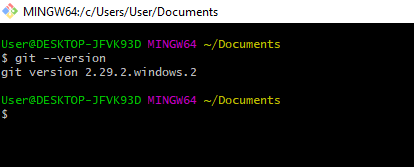  
5. выполните [первоначальную настройку](https://git-scm.com/book/ru/v2/%D0%92%D0%B2%D0%B5%D0%B4%D0%B5%D0%BD%D0%B8%D0%B5-%D0%9F%D0%B5%D1%80%D0%B2%D0%BE%D0%BD%D0%B0%D1%87%D0%B0%D0%BB%D1%8C%D0%BD%D0%B0%D1%8F-%D0%BD%D0%B0%D1%81%D1%82%D1%80%D0%BE%D0%B9%D0%BA%D0%B0-Git)
6. добавьте [ssh key](https://only-to-top.ru/blog/tools/2019-12-08-git-ssh-windows.html)

**Далее при работе с командной строкой я буду использовать git bash**

### Установка php
1. установите [Visual C++ Redistributable for Visual Studio 2015](http://www.microsoft.com/en-us/download/details.aspx?id=48145)
2. скачайте архив с [php](https://windows.php.net/download/) и выберете нужную вам версию
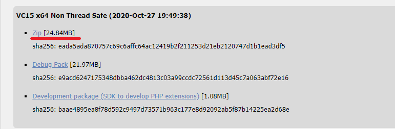 
3. извлеките архив в папку и скопируйте ее в C:/имя папки
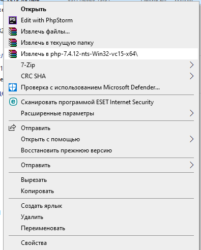 
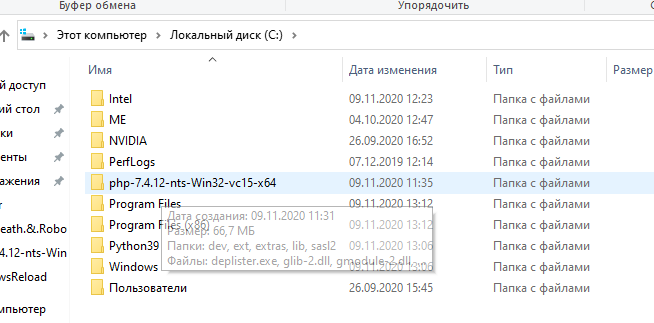 
4. замените php.ini-development на php.ini. Раскомментируйте строчки (просто удалите ; перед строкой)  
extension_dir = "ext"  
extension=curl  
extension=gd2  
extension=mbstring  
extension=mysqli  
extension=openssl  
extension=pdo_mysql  
extension=pdo_pgsql  
extension=pdo_sqlite  
extension=pgsql  
extension=sockets  
extension=xsl  

5. Перейдите в настройки системы
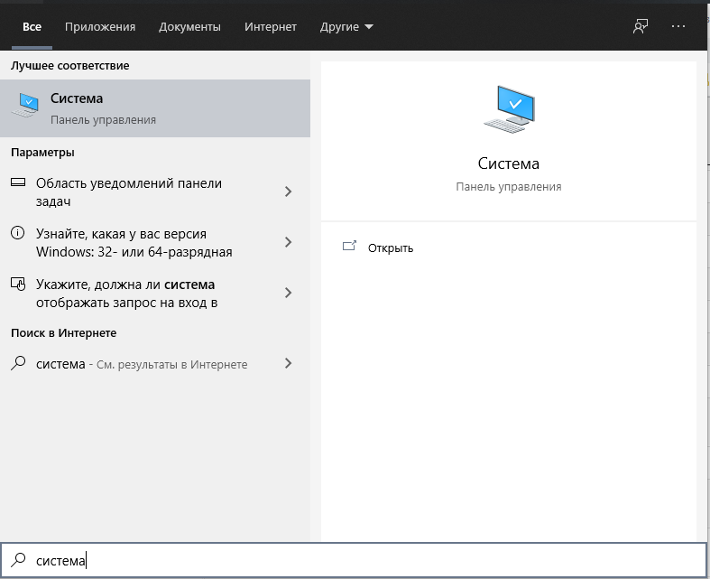
Откройте "Дополнительные параметры системы"
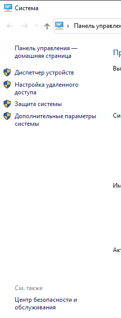
Откройте "Переменные среды"
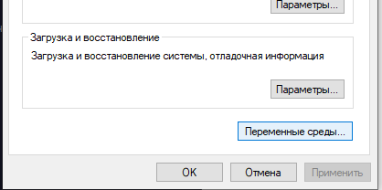
Найдите переменную Path (PATH) и нажмите "изменить"
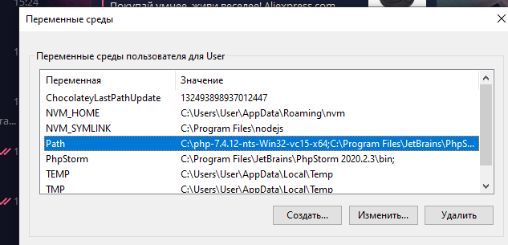
В новом окне нажмите "Создать" и добавьте путь до папки с php C:/имя папки
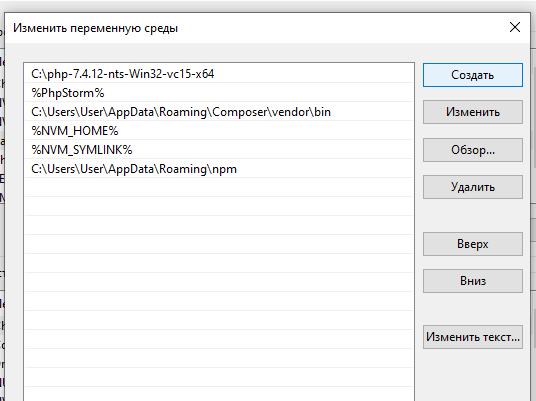

6. после установки закройте все терминалы и откройте git bash
7. выполните проверочную команду php -v
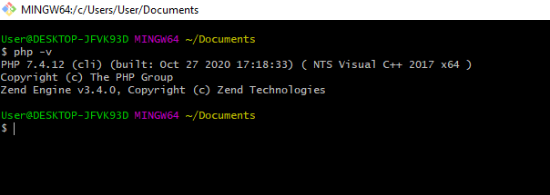

### Установка composer
1. Скачайте установочник composer для windows https://getcomposer.org/download/

2. Во время установки кажите путь до исполняемого файла php
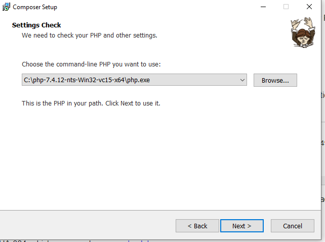

3. после установки закройте все терминалы и откройте git bash
4. выполните проверочную команду composer
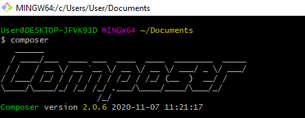

### Установка docker
1. Скачайте установочник docker для windows https://hub.docker.com/editions/community/docker-ce-desktop-windows/
2. После установки запустите Docker Desktop и при ошибке дополнительно установите пакет linux kernel https://docs.microsoft.com/ru-ru/windows/wsl/wsl2-kernel
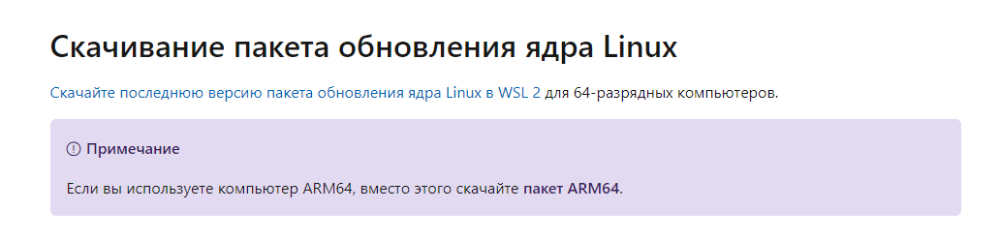
3. после установки закройте все терминалы и откройте git bash
4. выполните проверочную команду docker -v && docker-compose -v
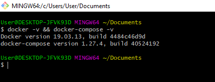

### Установка npm

1. скачайте установочник nodejs для windows https://nodejs.org/en/download/
2. установите node js в штатном режиме
3. после установки закройте все терминалы и откройте git bash
4. выполните проверочную команду npm -v
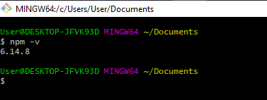